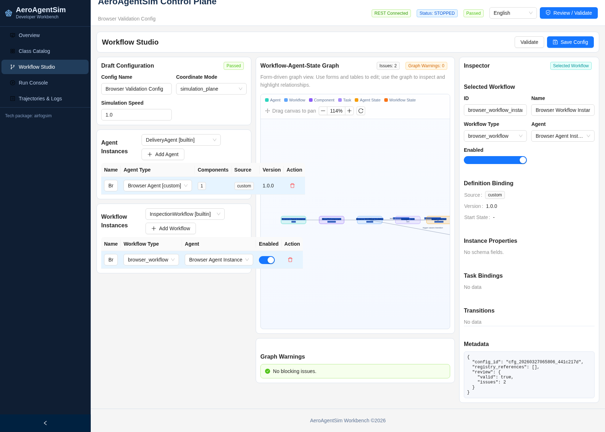

<a href="https://joss.theoj.org/papers/3bf61975c569326131f0bf169bfe4db9"></a>
[](https://doi.org/10.5281/zenodo.15779000)

# AeroAgentSim

<div align="center">
  
</div>

AeroAgentSim is the external product name for the simulation and developer workbench shipped in this repository. The Python package name, import path, and technical module namespace remain `airfogsim`.

AeroAgentSim builds on the existing `airfogsim` discrete-event simulation core to benchmark collaborative intelligence in low-altitude vehicular fog computing. The current workbench focuses on developer-facing configuration, workflow coupling inspection, run control, and lightweight 2D visualization rather than 3D scene rendering.

[中文版本](README_CN.md)

## Overview

- `airfogsim` remains the install target: `pip install airfogsim`
- the recommended local shell baseline is `conda activate airfogsim`
- Top-level imports now work: `from airfogsim import Environment`
- Historical compatibility import also works: `from airfogsim import AirFogSimEnv`
- The frontend has been rewritten as a 2D developer workbench
- 3D pages and 3D frontend dependencies have been removed
- Config snapshots and run artifacts are now separated on disk under `runtime/aeroagentsim/`
- custom `agent` / `task` / `workflow` definitions are file-based under `registry/aeroagentsim/`

## Developer Workbench

The AeroAgentSim workbench is centered around five pages:

1. `Overview`: current config version, recent run, and validation status
2. `Class Catalog`: agent/component/task/workflow metadata and compatibility lookup
3. `Workflow Studio`: table-form editing plus workflow-agent-state relation graph
4. `Run Console`: start, pause, resume, reset, critical path, live logs, and live 2D map
5. `Trajectories & Logs`: per-run trajectory replay and log inspection

Visualization is intentionally lightweight:

- 2D only, built on Leaflet
- `simulation_plane` mode uses `CRS.Simple`
- `geo_osm` mode uses geographic coordinates
- Live markers show agent type, position, altitude, workflow, task, and recent log context
- Trajectories are rendered as 2D polylines

The relation graph remains form-driven rather than node-edit driven. Configuration changes are made through table and form inputs, while the graph is used for coupling visualization, highlighting, validation context, critical-path display, and zoom/pan inspection. Scroll inside the graph canvas to zoom and drag the canvas to pan without moving the outer workbench page.



The workbench also supports:

- global `zh-CN` / `en-US` language switching in the UI
- page-local `Validate` in `Workflow Studio` for the in-progress draft
- a centralized `Review / Validate` flow for draft consistency checks
- merged catalog browsing across builtin and custom definitions
- table/form editing for custom workflow-related definitions without uploading Python code

## Custom Registry

Custom definitions are stored as files and treated as the source of truth:

- `registry/aeroagentsim/agents/`
- `registry/aeroagentsim/tasks/`
- `registry/aeroagentsim/workflows/`

Each definition carries metadata such as:

- `id`
- `version`
- `display_name`
- `description`
- `schema_version`
- `source`
- `created_at`
- `updated_at`

The current v1 model is declarative. Users can extend agent, task, and workflow definitions from the workbench, but cannot upload arbitrary Python plugins. Runtime execution still goes through the existing `airfogsim` component and workflow machinery by way of adapter and proxy compilation.

## Runtime Model

Configuration and runtime artifacts are now split:

- Config snapshots are immutable and stored under `runtime/aeroagentsim/configs/`
- Each simulation launch creates a unique `run_id`
- Run artifacts are stored under `runtime/aeroagentsim/runs/<run_id>/`
- Typical run subdirectories are `logs/`, `workflow_states/`, `trajectories/`, `spatial/`, and `metrics/`
- SQLite is kept as a lightweight active-run cache and index, not the primary historical log store

Control and updates are also split:

- REST handles start, pause, resume, reset, save, validate, and graph/config requests
- WebSocket pushes `sim_status`, `workflow_state_diff`, `spatial_snapshot`, and `log_event`

Run start also performs runtime preflight. Non-blocking compatibility findings, including skipped default `create_airspace` / `create_frequency` injection when the current runtime does not expose those methods, remain warnings. Only preflight errors block `POST /api/runs`.

## Installation

```bash
conda activate airfogsim
pip install airfogsim
```

> **Note:** The PyPI release may lag behind the source. If you see
> `ImportError` for `AirFogSimEnv` or other names, install from source:
> ```bash
> pip install git+https://github.com/ZhiweiWei-NAMI/AirFogSim.git
> ```
> Or clone and install in editable mode — see [INSTALL.md](INSTALL.md).

For source installs and frontend setup, see [INSTALL.md](INSTALL.md).

### Verify the package

```bash
python -c "import airfogsim; from airfogsim import Environment, AirFogSimEnv; print('ok')"
```

`AirFogSimEnv` is kept as a compatibility alias. New code should prefer `Environment`.

## Quick Example

```python
from airfogsim import Environment
from airfogsim.agent import DroneAgent
from airfogsim.component import ChargingComponent, MoveToComponent
from airfogsim.workflow.inspection import create_inspection_workflow

env = Environment()

drone = env.create_agent(
    DroneAgent,
    "drone1",
    properties={
        "position": [10, 10, 0],
        "battery_level": 100,
    },
)

drone.add_component(MoveToComponent(env, drone))
drone.add_component(ChargingComponent(env, drone))

workflow = create_inspection_workflow(
    env,
    drone,
    [
        (10, 10, 50),
        (100, 40, 80),
        (180, 120, 60),
        (10, 10, 0),
    ],
)

workflow.start()
env.run(until=600)
```

## Start the Workbench

```bash
python main_for_visualization.py --backend-port 8002 --frontend-port 3000
```

The workbench uses the existing `airfogsim` backend with the AeroAgentSim 2D frontend. There is no 3D map page in the current interface.

## API Surface

The current workbench API exposes these main groups:

- `GET /api/catalog/agents|components|tasks|workflows`
- `GET /api/catalog/compatibility`
- `GET/POST /api/registry/{kind}`
- `GET/PUT/DELETE /api/registry/{kind}/{definition_id}`
- `POST /api/registry/{kind}/{definition_id}/validate`
- `GET/PUT /api/configs/{config_id}`
- `GET/POST /api/configs/{config_id}/graph`
- `POST /api/configs/{config_id}/preflight`
- `POST /api/configs/{config_id}/validate`
- `GET /api/health`
- `POST /api/runtime/reset`
- `GET /api/runs`
- `POST /api/runs`
- `POST /api/runs/{run_id}/pause|resume|reset`
- `DELETE /api/runs/{run_id}`
- `GET /api/runs/{run_id}/status|logs|trajectories|spatial`

## Documentation

- [Installation Guide](INSTALL.md)
- [Documentation Guide](DOCUMENTATION_GUIDE.md)
- [Documentation Hub](docs/README.md)
- [System Architecture](src/airfogsim/docs/en/architecture.md)

## Citation

If you use the simulator in research, please cite:

```bibtex
@misc{wei2024airfogsimlightweightmodularsimulator,
      title={AirFogSim: A Light-Weight and Modular Simulator for UAV-Integrated Vehicular Fog Computing},
      author={Zhiwei Wei and Chenran Huang and Bing Li and Yiting Zhao and Xiang Cheng and Liuqing Yang and Rongqing Zhang},
      year={2024},
      eprint={2409.02518},
      archivePrefix={arXiv},
      primaryClass={cs.NI},
      url={https://arxiv.org/abs/2409.02518},
}
```
