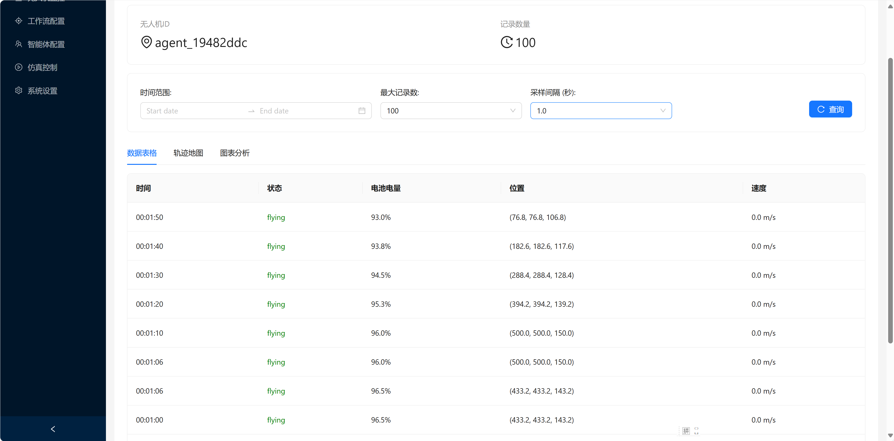
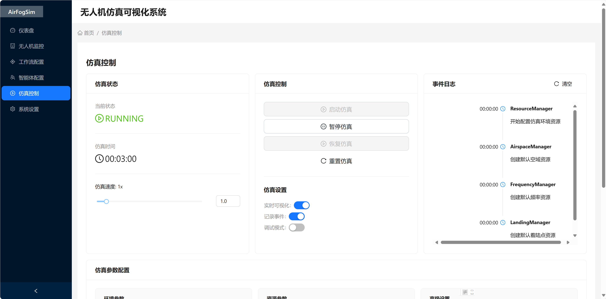
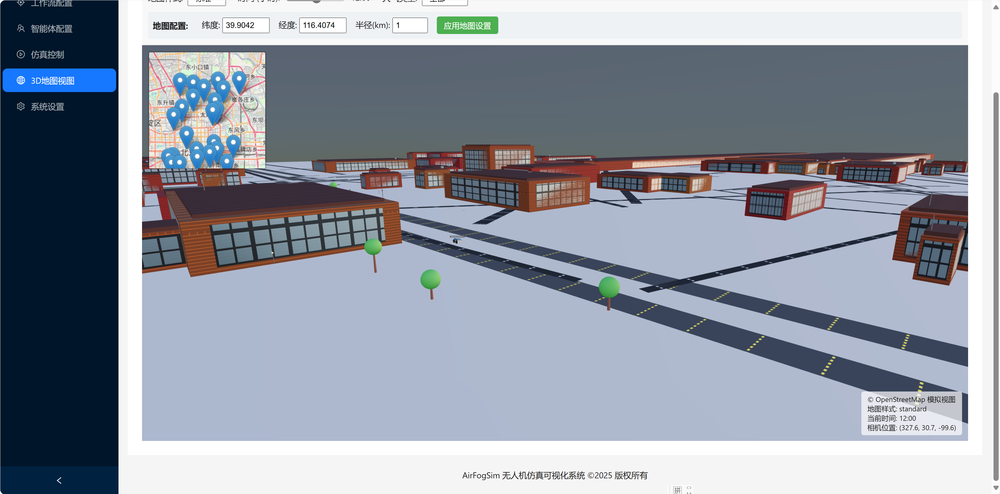
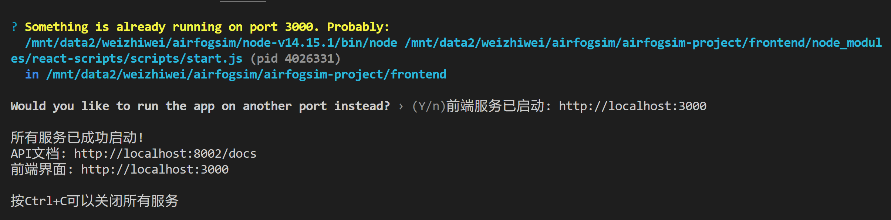

# AirFogSim: 空中雾计算仿真框架

<div align="center">
  
</div>

AirFogSim是一个基于SimPy构建的离散事件仿真框架，旨在模拟涉及自治代理（如无人机）、动态资源、任务执行和面向目标的工作流的复杂系统。该框架特别适用于研究空中雾计算场景、无人机协同作业、智能交通系统等领域的仿真与优化。

## 📋 项目概述

AirFogSim提供了一个全面的仿真环境，用于：

- 模拟无人机等自治代理在复杂环境中的行为
- 研究资源分配和任务调度策略
- 评估不同工作流和协议的性能
- 可视化仿真过程和结果分析

该框架采用模块化设计，支持高度自定义的仿真场景，并提供直观的可视化界面，便于研究人员和开发者进行实验和分析。

如果您在研究中使用了AirFogSim，请引用我们的论文：

```bibtex
@misc{wei2024airfogsimlightweightmodularsimulator,
      title={AirFogSim: A Light-Weight and Modular Simulator for UAV-Integrated Vehicular Fog Computing}, 
      author={Zhiwei Wei and Chenran Huang and Bing Li and Yiting Zhao and Xiang Cheng and Liuqing Yang and Rongqing Zhang},
      year={2024},
      eprint={2409.02518},
      archivePrefix={arXiv},
      primaryClass={cs.NI},
      url={https://arxiv.org/abs/2409.02518}, 
}
```

## ✨ 核心特性

- **以代理为中心的自治系统**：代理（如无人机）作为主要行动者，拥有内部状态，能够自主决策
- **事件驱动的交互模型**：组件间通过事件注册中心进行通信和同步
- **关注点分离**：清晰划分Agent、Component、Task、Workflow、Resource等核心概念
- **模块化与可扩展性**：通过子类化核心组件轻松扩展功能
- **实时可视化**：集成的前端界面，支持实时监控和数据分析
- **与LLM集成**：支持通过大型语言模型进行任务规划和决策

## 🏗️ 系统架构

AirFogSim由以下核心组件构成：

### 1. 仿真环境 (Environment)

基于SimPy的离散事件调度器，包含：
- 事件注册中心（EventRegistry）：用于组件间通信
- 空域管理器（AirspaceManager）：八叉树管理位置和碰撞信息
- 着陆点管理器（LandingManager）：管理着陆点和充电站
- 频谱资源管理器（SpectrumManager）：管理频谱资源
- 合同管理器（ContractManager）：管理合同和交易进行
- 工作流管理器（WorkflowManager）：管理工作流的生命周期
- 任务管理器（TaskManager）：管理任务的创建
- 数据提供器（DataProvider）：提供实时数据和统计信息，包括天气、交通流等

### 2. 代理 (Agent)

自治的决策实体，如无人机、地面站等，具有：
- 内部状态管理
- 决策逻辑
- 组件所有权
- 任务发起能力

### 3. 组件 (Component)

抽象特定能力（如移动、计算、充电等），负责：
- 任务执行环境
- 资源交互
- 性能指标计算

### 4. 任务 (Task)

封装具体行动的逻辑，定义：
- 执行过程
- 状态产出
- 指标消耗

### 5. 工作流 (Workflow)

代表高级目标或过程，作为：
- 基于事件的监控器
- 状态机
- 协调器


## 📊 可视化系统

AirFogSim集成了一个完整的可视化系统，包括：

- **仪表盘**：显示仿真状态、代理信息和系统事件
- **无人机监控**：实时追踪无人机位置、状态和轨迹
- **工作流配置**：配置和监控工作流执行
- **数据分析**：资源使用情况和性能指标分析

<div align="center">
  
  <p><em>状态监控界面 - 实时跟踪无人机位置和状态</em></p>
</div>

可视化系统采用前后端分离架构：
- 前端：基于React的Web应用
  <div align="center">
    
    <p><em>前端界面 - 用户交互与数据可视化</em></p>
  </div>
- 前端：基于SUMO的3D交通仿真可视化
  <div align="center">
    
    <p><em>前端界面 - 3D交通仿真可视化</em></p>
  </div>
- 后端：FastAPI服务，与仿真引擎集成
  <div align="center">
    
    <p><em>后端架构 - 数据处理与仿真引擎集成</em></p>
  </div>
- 通信：通过WebSocket实现实时数据传输

## 🚀 安装指南

### 前提条件

- Python 3.8+
- Node.js 14+
- npm 6+

### 安装步骤

1. 克隆仓库

```bash
git clone https://github.com/ZhiweiWei-NAMI/AirFogSim.git
cd AirFogSim
```

2. 安装Python依赖

```bash
python -m venv airfogsim_venv
source airfogsim_venv/bin/activate && echo "虚拟环境已激活"
pip install -r requirements.txt
pip install -e .  # 以开发模式安装
```

3. 安装前端依赖

```bash
cd frontend
npm install
cd ..
```

4. 启动可视化系统

```bash
python main_for_visualization.py
```

这将启动后端API服务和前端开发服务器，并自动在浏览器中打开可视化界面。

5. 测试运行脚本（可选）

```bash
python -m unittest discover -s src/airfogsim/tests
```


### 使用 Docker 运行 (未完善)

这是推荐的运行方式，可以确保环境一致性并简化部署。

**前提条件:**

- Docker ([https://www.docker.com/get-started](https://www.docker.com/get-started))
- Docker Compose ([https://docs.docker.com/compose/install/](https://docs.docker.com/compose/install/))

**运行步骤:**

1.  **克隆仓库 (如果尚未完成):**
   ```bash
   # 替换为你的仓库 URL
   git clone https://github.com/ZhiweiWei-NAMI/AirFogSim.git
   cd AirFogSim
   ```

2.  **构建前端静态文件:**
   > **注意:** 当前 Docker Compose 配置依赖于在主机上预先构建的前端文件。
   ```bash
   cd frontend
   npm install
   npm run build
   cd ..
   ```

3.  **构建并启动 Docker 服务:**
   ```bash
   docker-compose build
   docker-compose up -d
   ```
   这将构建后端镜像，并启动后端和 Nginx 服务。

4.  **访问应用:**
   在浏览器中打开 `http://localhost`。

5.  **查看日志:**
   ```bash
   docker-compose logs -f  # 查看所有服务日志
   docker-compose logs -f backend # 查看后端日志
   docker-compose logs -f nginx   # 查看 Nginx 日志
   ```

6.  **停止服务:**
   ```bash
   docker-compose down
   ```

## 📝 使用示例

### 基本仿真示例

```python
from airfogsim.core.environment import Environment
from airfogsim.agent import DroneAgent
from airfogsim.component import MoveToComponent, ChargingComponent
from airfogsim.workflow.inspection import create_inspection_workflow

# 创建环境
env = Environment()

# 创建无人机代理
drone = env.create_agent(
    DroneAgent, 
    "drone1", 
    initial_position=(10, 10, 0),
    initial_battery=100
)

# 添加组件
move_component = MoveToComponent(env, drone)
charging_component = ChargingComponent(env, drone)
drone.add_component(move_component)
drone.add_component(charging_component)

# 创建巡检工作流
waypoints = [
    (10, 10, 100),    # 起飞
    (400, 400, 150),  # 中间点
    (800, 800, 150),  # 目的地
    (800, 800, 0),    # 降落
    (800, 800, 100),  # 起飞返回
    (10, 10, 0)       # 返回起点
]
workflow = create_inspection_workflow(env, drone, waypoints)

# 启动工作流
workflow.start()

# 运行仿真
env.run(until=1000)
```

### 启动可视化界面

```bash
python main_for_visualization.py --backend-port 8002 --frontend-port 3000
```

## 🧪 示例程序与自动测试

AirFogSim提供了丰富的示例程序，展示框架的各种功能和使用场景。这些示例位于`src/airfogsim/examples`目录下：

### 主要示例程序

- **触发器系统示例**: `trigger_example.py` - 展示如何使用不同类型的触发器创建和管理工作流
- **工作流图表生成**: `workflow_diagram_demo.py` - 演示如何将工作流状态机转换为可视化图表
- **图像处理工作流**: `run_image_processing.py` - 展示环境图像感知处理的完整工作流
- **多任务合约示例**: `run_multi_task_contract.py` - 演示合约工作流如何管理多个任务
- **无人机巡检示例**: `run_drone_inspection.py` - 展示无人机巡检路径规划和自动充电功能
- **天气数据集成**: `demo_weather_provider_api.py` - 演示如何集成实时天气数据到仿真中

### 一键测试示例

我们提供了一个自动测试脚本，可以轻松运行和验证所有示例：

```bash
# 列出所有可用的示例
cd src/airfogsim/examples
python test_examples.py --list

# 运行特定示例
python test_examples.py --run workflow_diagram_demo trigger_example

# 运行所有示例
python test_examples.py
```

示例测试脚本会自动检查必要的依赖条件（如API密钥），并提供详细的测试结果报告。这使得新用户可以快速了解框架的功能，开发者也能方便地验证不同模块的正确性。

## 📁 项目结构

```
airfogsim-project/
├── .dockerignore             # Docker 构建忽略文件 (后端)
├── .env                      # 后端环境变量 (本地, 不提交到 Git)
├── Dockerfile                # 后端 Dockerfile
├── docker-compose.yml        # Docker Compose 编排文件
├── frontend/                 # 前端可视化界面
│   ├── .dockerignore         # Docker 构建忽略文件 (前端)
│   ├── .env                  # 前端环境变量 (本地, 不提交到 Git)
│   ├── Dockerfile            # 前端 Dockerfile
│   ├── build/                # 前端构建产物 (本地生成)
│   ├── node_modules/         # (本地, 不提交到 Git)
│   ├── package.json
│   ├── public/               # 静态资源
│   └── src/                  # 前端源代码
│       ├── pages/            # 页面组件
│       └── services/         # API服务
├── LICENSE                   # 项目许可证
├── main_for_visualization.py # 可视化系统启动脚本 (本地开发用)
├── nginx.conf                # Nginx 配置文件
├── pyproject.toml            # Python 项目配置文件 (含依赖)
├── README.md                 # 本文档
├── requirements.txt          # Python 锁定依赖 (由 pip-compile 生成)
├── src/                      # 后端源代码
│   └── airfogsim/            # 核心仿真框架
│       ├── agent/            # 代理实现
│       ├── component/        # 组件实现
│       ├── core/             # 核心类和接口
│       ├── docs/             # 文档
│       ├── event/            # 事件处理
│       ├── examples/         # 示例代码
│       ├── manager/          # 各类管理器
│       ├── resource/         # 资源实现
│       ├── task/             # 任务实现
│       ├── visualization/    # 可视化相关 (FastAPI 应用)
│       └── workflow/         # 工作流实现
└── ... (其他配置文件、测试文件等)
```

## 📚 文档

详细的文档可在以下位置找到：

- [系统架构](src/airfogsim/docs/cn/architecture_cn.md)
- [代理指南](src/airfogsim/docs/cn/agent_guide_cn.md)
- [组件指南](src/airfogsim/docs/cn/component_guide_cn.md)
- [任务指南](src/airfogsim/docs/cn/task_guide_cn.md)
- [触发器指南](src/airfogsim/docs/cn/trigger_guide_cn.md)
- [工作流指南](src/airfogsim/docs/cn/workflow_cn.md)

## 🤝 贡献指南

我们欢迎各种形式的贡献，包括但不限于：

- 报告问题和提出建议
- 提交代码改进和新功能
- 完善文档和示例
- 分享使用案例和应用场景

请遵循以下步骤：

1. Fork仓库
2. 创建功能分支 (`git checkout -b feature/amazing-feature`)
3. 提交更改 (`git commit -m 'Add some amazing feature'`)
4. 推送到分支 (`git push origin feature/amazing-feature`)
5. 创建Pull Request

## 📄 许可证

本项目采用MIT许可证 - 详情请参阅[LICENSE](LICENSE)文件。

---

**AirFogSim** - 为空中雾计算研究提供强大的仿真工具