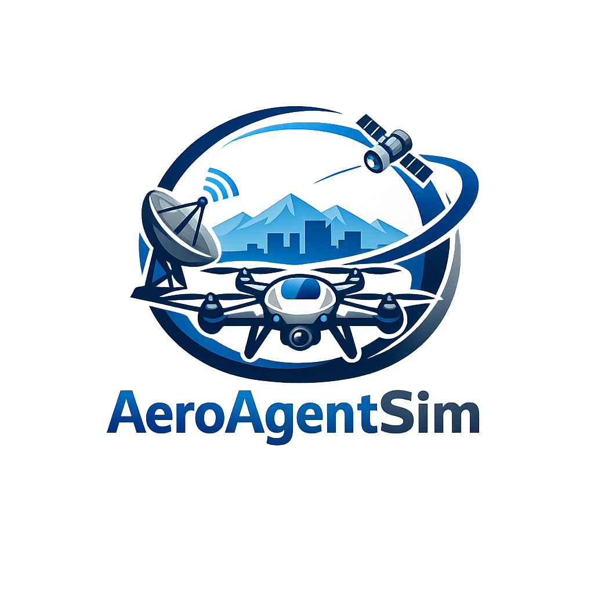
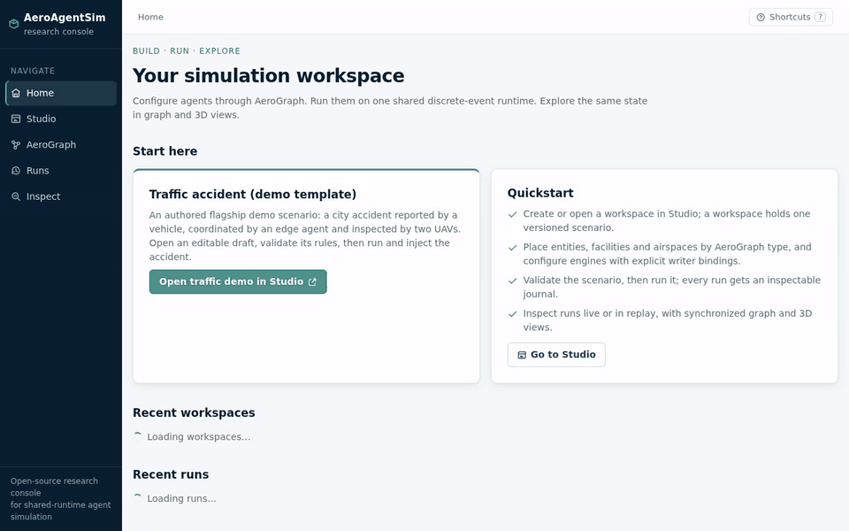
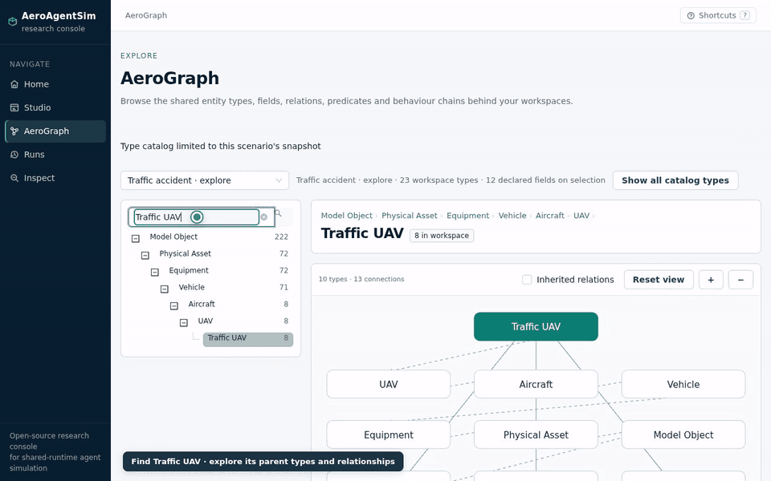
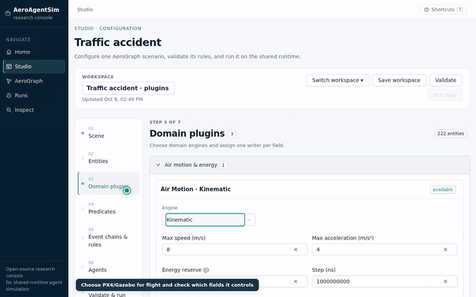
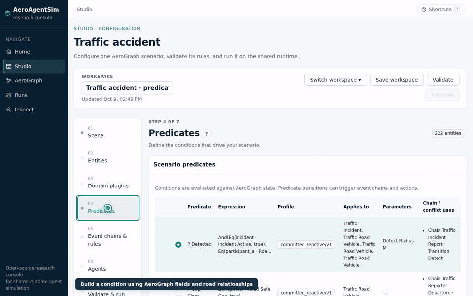
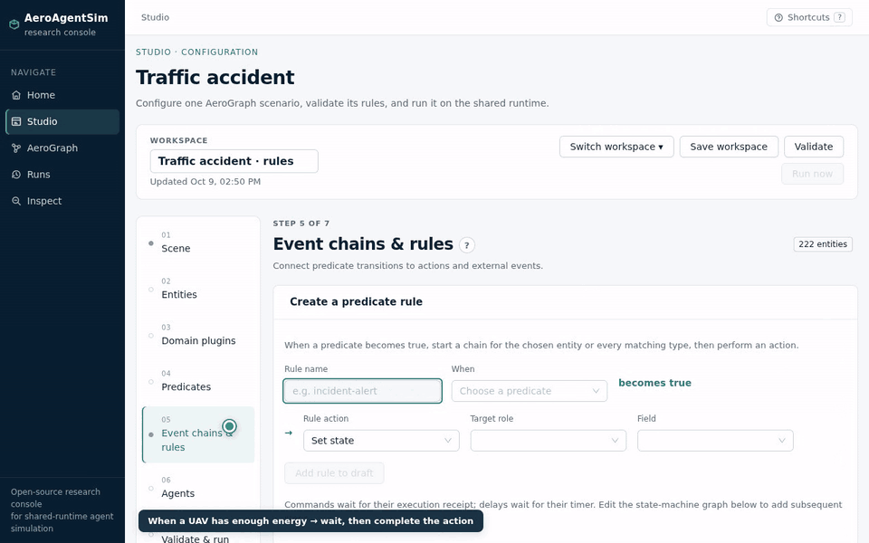
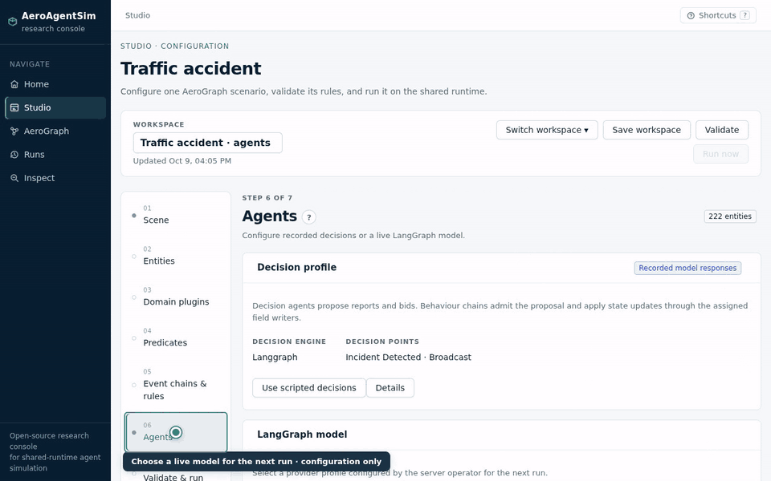
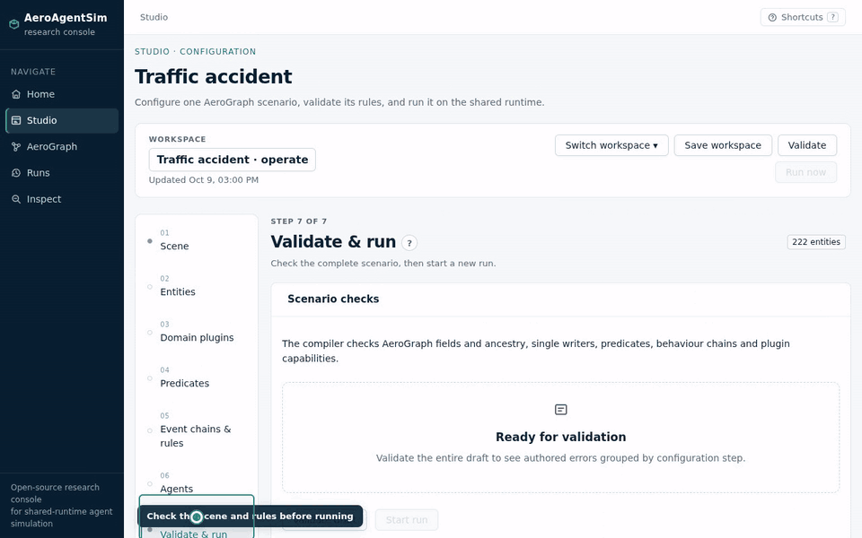
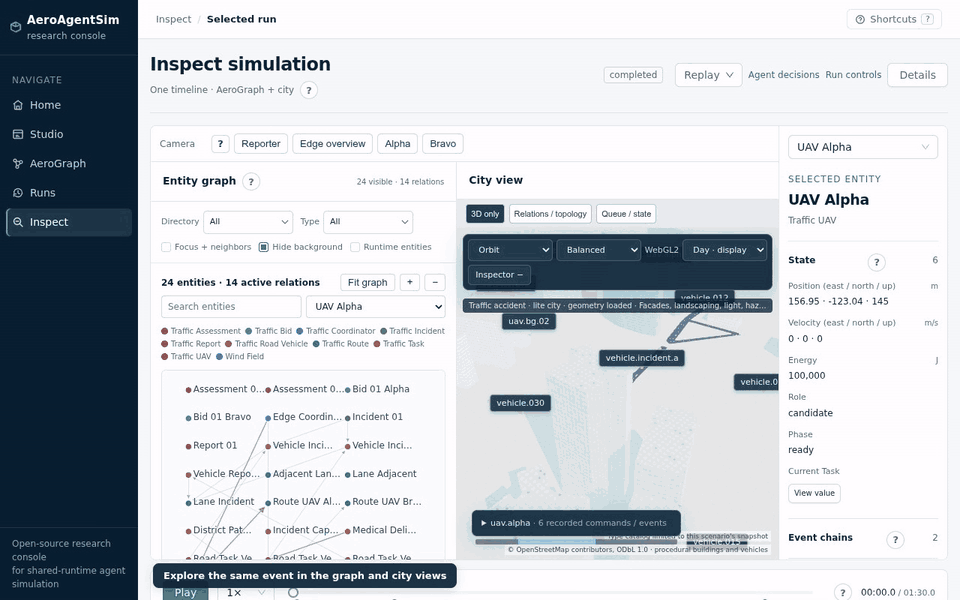
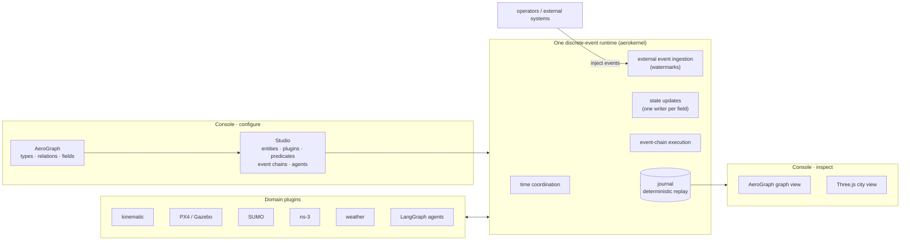

<p align="center">
  
</p>

<h1 align="center">AeroAgentSim</h1>

<p align="center">
  <b>An open-source research platform for multi-agent low-altitude simulation.</b><br>
  Model the world with AeroGraph, wire behaviour with predicates and event chains,<br>
  plug in PX4/Gazebo, SUMO, ns-3 and weather, deploy LangGraph agents — and watch it all on one timeline.
</p>

<p align="center">
  <a href="https://github.com/ZhiweiWei-NAMI/AeroAgentSim/actions/workflows/tests.yml"></a>
  <a href="LICENSE"></a>
  
  
  <a href="docs/README.md"></a>
</p>

<p align="center">
  <a href="#quickstart">Quickstart</a> ·
  <a href="#a-tour-of-the-console">Console tour</a> ·
  <a href="#how-it-works">How it works</a> ·
  <a href="#the-flagship-demo-a-traffic-accident">Flagship demo</a> ·
  <a href="docs/README.md">Documentation</a> ·
  <a href="README_CN.md">中文</a>
</p>

<p align="center">
  
</p>

---

## Why AeroAgentSim

Research on drones, ground traffic, networks and AI agents usually means gluing several simulators together with scripts, clocks that drift apart and state that nobody owns. AeroAgentSim gives you **one discrete-event runtime** that every model plugs into, and a **console** to configure, run and inspect experiments without writing glue code.

| | |
|---|---|
| 🧭 **One shared runtime** | A single discrete-event kernel coordinates time, external event ingestion, state updates and event-chain execution for every plugin. Runs are journaled and **replay deterministically**. |
| 🕸️ **AeroGraph-driven modelling** | Entities, relations and typed state come from the AeroGraph ontology. Configure by type: every `Traffic UAV` gets its fields, routines and rules automatically. |
| 🔁 **Predicates → event chains** | “When predicate *P* becomes true for entity *e*, do *A*.” Triggers, guards and transitions are predicates; routine chains are auto-instantiated from types, tasks and relations; conflict predicates raise events. |
| 🔌 **Replaceable domain plugins** | Kinematic, **PX4/Gazebo**, **SUMO**, **ns-3** and **weather** plug in behind the same contract. Every state field has exactly **one writer**, so swapping a simulator is a configuration change. |
| 🤖 **LLM agents that are reproducible** | LangGraph decision agents propose actions; the runtime authorizes them against committed state. Model calls are journaled, so replay makes **zero** model calls. |
| 👀 **Two synchronized views** | An AeroGraph graph view (including entities without a 3D pose) and a Three.js city view share identities, state and one timeline. |
| 🧪 **Built for experiments** | Inject external events while a run is live, pause/stop cleanly, compare runs, export captures. Lean provenance by default; `--provenance full` when you need an audit trail. |

## Quickstart

Requirements: Python ≥ 3.10, Node.js 22 + npm, and a Chromium that Playwright can use (for the in-simulation camera). No GPU, Docker, AeroGraph checkout or private assets are needed for the demo.

```bash
git clone https://github.com/ZhiweiWei-NAMI/AeroAgentSim.git && cd AeroAgentSim
python -m venv .venv && source .venv/bin/activate

python -m pip install -e ./aerokernel -e '.[server]'   # kernel + platform
(cd frontend && npm ci && npm run build)                 # console
aeroagentsim demo traffic-accident                       # opens the console with the demo
```

Prefer the terminal? `aeroagentsim demo traffic-accident --headless` runs the same experiment and prints the accident, award, capture and upload times plus the journal path; `aeroagentsim replay <run-dir>` replays it without calling any physics engine, camera or model.

➡️ Full instructions: [Install](docs/getting-started/install.md) · [Quickstart](docs/getting-started/quickstart.md) · [Your first scenario](docs/getting-started/first-scenario.md)

## A tour of the console

The console follows the research workflow: **know the world → configure → simulate → deploy agents → visualize**.

### 1. Get to know AeroGraph

Browse the ontology behind your scenario: type ancestry, fields and units, which plugin writes each field, relations, and the predicates and event chains that use a type. Without an AeroGraph checkout the catalog comes from the scenario's committed snapshot.

<p align="center"></p>

📖 [AeroGraph concepts](docs/concepts/aerograph.md)

### 2. Configure domain plugins — PX4/Gazebo, SUMO, weather

Studio walks through seven steps: **Scene → Entities → Domain plugins → Predicates → Event chains & rules → Agents → Validate & run**. In *Domain plugins*, pick the engine for each domain (air motion: kinematic or PX4/Gazebo; road traffic: kinematic or SUMO; network: ns-3; weather), tune its parameters, and check the field-ownership table — conflicts are flagged before you run.

<p align="center"></p>

📖 [Plugins & field ownership](docs/concepts/plugins.md) · [PX4/Gazebo](docs/guides/px4-gazebo.md) · [SUMO](docs/guides/sumo.md) · [Weather](docs/guides/weather.md) · [Write your own plugin](docs/guides/plugins.md)

### 3. Define predicates

Predicates are typed conditions over AeroGraph state — distances, speeds, relations, dwell times. Pick fields with an AeroGraph-aware picker, set thresholds and let the compiler check them against the registry.

<p align="center"></p>

📖 [Predicates](docs/concepts/predicates.md) · [Write a predicate](docs/guides/predicates.md) · [Predicate dialect](docs/reference/predicate-dialect.md)

### 4. Author rules, event chains and external events

Build rules like *“when `accident detected` becomes true for every Traffic UAV → emit an event / issue a command / update state”*. Chains bind automatically to entities by type, task or relation; conflict rules turn predicate conflicts into events; injection points let operators or external systems drive the run.

<p align="center"></p>

📖 [Behaviours & event chains](docs/concepts/behaviours.md) · [Author a rule](docs/guides/behaviours.md) · [Inject external events](docs/guides/external-events.md)

### 5. Deploy agents

Attach LangGraph decision agents to decision points: choose recorded (scripted, reproducible) or live model mode, select an operator-configured provider profile, and grant the tools an agent may use. Every prompt, reply and resulting command is journaled and inspectable.

<p align="center"></p>

📖 [Agents](docs/concepts/agents.md) · [Deploy an agent](docs/guides/agents.md)

### 6. Simulate

Validate, start a run, and operate it live: pause, resume, stop, or inject an event with one click. A run waiting for input shows the pending streams; it times out only when the scenario declares a wait budget.

<p align="center"></p>

📖 [Runs, replay & provenance](docs/concepts/runs.md)

### 7. Visualize and inspect

Inspect any run — live or replayed — in synchronized graph and 3D views: switch cameras, jump to the accident, award and capture moments on the timeline, select an entity in either view and see its committed state, active chains and predicate truth.

<p align="center"></p>

📖 [Views](docs/concepts/views.md) · [Visualize & inspect](docs/guides/visualization.md)

## How it works


```mermaid
flowchart LR
    subgraph Configure["Console · configure"]
        AG["AeroGraph<br/>types · relations · fields"]
        ST["Studio<br/>entities · plugins · predicates<br/>event chains · agents"]
    end
    subgraph Runtime["One discrete-event runtime (aerokernel)"]
        T["time coordination"]
        I["external event ingestion<br/>(watermarks)"]
        S["state updates<br/>(one writer per field)"]
        E["event-chain execution"]
        J[("journal<br/>deterministic replay")]
    end
    subgraph Plugins["Domain plugins"]
        K["kinematic"]
        PX["PX4 / Gazebo"]
        SU["SUMO"]
        NS["ns-3"]
        W["weather"]
        LG["LangGraph agents"]
    end
    subgraph Views["Console · inspect"]
        GV["AeroGraph graph view"]
        V3["Three.js city view"]
    end
    AG --> ST --> Runtime
    Plugins <--> Runtime
    OP["operators / external systems"] -- inject events --> I
    Runtime --> J --> Views
```

- **The console configures, the runtime executes.** A scenario (YAML) is compiled against the AeroGraph registry; the runtime then owns time, state and event delivery for every plugin.
- **Single field ownership.** Each `(entity, field)` has exactly one writer. Physics, traffic, network, weather and business logic can own different fields of the same entity — never the same one.
- **Predicates drive behaviour.** Predicate transitions trigger chains; guards and transitions are predicates too; conflicts become events.
- **Everything is a recorded fact.** Views read the committed feed, never engine internals, so the graph view, the 3D view and replay always agree.

📖 [Architecture](docs/concepts/architecture.md) · [Design notes](docs/design-notes.md)

## The flagship demo: a traffic accident

63 road vehicles, 8 UAVs and an edge coordinator in a city block from OpenStreetMap. Two vehicles collide; a passing vehicle reports it; the coordinator asks nearby UAVs for bids; **Alpha** declines because it is on a non-interruptible medical delivery; **Bravo** wins, flies over, holds position and photographs the scene with a camera rendered in the city view; the upload completes the task.

| Simulated time | What happens |
|---:|---|
| 0 s | Routine chains start for every vehicle and UAV |
| 8 s | Accident (timer, or injected by an operator in the console) |
| ~15 s | Bids collected, Bravo awarded; Alpha keeps its medical task |
| ~49 s | Bravo holds over the scene, captures and uploads the photo |

On a desktop CPU the whole chain completes in about **30 seconds of wall time** (1 Hz physics, faster than real time). Every step is visible in both views and in the journal.

📖 [Walkthrough and how to change it](docs/examples/traffic-accident.md)

## Repository layout

```text
aerokernel/          the discrete-event kernel (pure Python, standalone package)
src/aeroagentsim/    platform: scenario compiler, plugins, behaviours, agents, HTTP API, CLI
frontend/            console: React + Three.js (Studio, AeroGraph, Runs, Inspect)
scenarios/           example scenarios, incl. demos/traffic-accident
containers/          PX4/Gazebo, SUMO and ns-3 services
docs/                getting started, concepts, guides, reference
```

## Status

AeroAgentSim 2.0 is the first public release of the consolidated platform. Things to know:

- The shipped demo runs on the kinematic and scripted-decision profiles out of the box. PX4/Gazebo, SUMO and ns-3 run as separate container services — see [Containers](docs/guides/containers.md).
- Pure-Python kernel performance: real time at 1 Hz for the full demo; high-rate (15 Hz) physics currently runs at about 0.25× real time.
- Live LLM mode needs your own provider configuration; recorded mode reproduces results exactly.

Looking for the earlier AirFogSim code base? It is preserved on the [`archive/airfogsim`](https://github.com/ZhiweiWei-NAMI/AeroAgentSim/tree/archive/airfogsim) branch, and the earlier public package remains available as [version 1.1.1](https://pypi.org/project/aeroagentsim/1.1.1/).

## Contributing

Issues and pull requests are welcome — new domain plugins, scenarios, predicates and agent graphs especially. Start with [CONTRIBUTING.md](CONTRIBUTING.md) and the [plugin guide](docs/guides/plugins.md).

## License and acknowledgements

AeroAgentSim is released under the [Apache License 2.0](LICENSE). The demo city is derived from © OpenStreetMap contributors (ODbL 1.0). AeroAgentSim integrates with PX4, Gazebo, SUMO, ns-3, LangGraph and Three.js; each remains under its own license.
