# City Operations Workspace: Backend Integration Design

Status checked on 2026-09-30. Strict parsing, Provider registration, Agent authorization, step barriers, the RunEvent ledger, sealing, and independent verification are implemented; complete formal execution of city operations remains blocked. This document distinguishes implemented interfaces, proposed integration, and current blockers. Drafts, plans, and command receipts do not count as physical success.

Stage 1 has not passed in this iteration: joint acceptance of the new 414 buildings with ground source data/SUMO, street facilities, weather, and rendering is incomplete. Facility configuration, local planning, and container self-checks for earlier selections retain their own evidence scope; they do not establish acceptance of the new city or actual logistics transport. See the [five-stage plan](city-authoring-plan.md) for stage status.

## Delivery Scope

The workspace first saves editable drafts. Formal runs must use the existing execution path; drafts, directed previews, and visual effects must not write authoritative state.

```mermaid
flowchart LR
    D[Frontend draft] --> C[Compiler to build / strict Domain Specs]
    C --> R[resolve_suite / immutable ResolvedRun]
    R --> P[Capability and feasibility preflight]
    P --> E[Explicit executor materialization]
    E --> H[Harness + Gateway / Provider barriers]
    H --> S[Sealed evidence]
    S --> V[Independent Verifier]
    V --> T[Read-only Public Trace / Viewer]
```

`ControlClient.startRun` in `frontend/src/run-control.ts` starts an existing Run ID only; it neither compiles a logistics workspace nor deploys new Providers. The draft compiler must emit strict `SuiteSpec`, `TaskSpec`, task packages, `EnvironmentSpec`, `AgentSpec`, and world packages, from which the existing `config.resolver.resolve_suite` produces `ResolvedRunSpec`. Compilation errors, missing capabilities, or failed preflight must appear as specific blockers in the interface, rather than a successful deployment. Executor profiles are selected explicitly; missing cluster prerequisites must not cause an automatic switch to Docker.

| Current call site | Implemented responsibility |
| --- | --- |
| `config/models.py:StrictModel`, `config/resolver.py:TaskPackageResolver/_resolve_case` | Strict domain inputs, task projection, matrix application, feasibility, and resolved identity for the complete inputs; all paths are under `aero_bench/`. |
| `tasks/registry.py`, `providers/registry.py:ProviderRegistration/build_session` | Register task resolvers/hooks and actual Provider adapters; sessions validate manifests, configuration, and resolved scenarios. Registration does not establish that a task is executable. |
| `gateway/service.py:AgentCredentialStore`, `gateway/dispatcher.py:GatewayDispatcher.invoke` | Authenticate run-bound Agents, validate grants/schema/simulation instants/retry rules, and record commands and receipts. |
| `runtime/harness.py:HarnessCoordinator`, `runtime/scene_state.py:SceneStateAssembler` | Complete Provider barriers, a single Harness clock, and canonical SceneState from closed motion; ns-3 and business stages then consume it. |
| `runtime/ledger.py:EventLedger`, `runtime/evidence.py:load_sealed_event_ledger`, `trace/projector.py` | One run ledger, independent verification after sealing, and read-only public projection; the current stage attribution verification gap is described below. |

Capability negotiation occurs during resolution and preflight: Provider capabilities must cover every `TaskSpec.required_capabilities` and world requirement; grants restrict available tools, queries, and observations. Declared protocol schema versions, image digests, and backend identities are checked. Valid capability supersets are allowed. Run startup rechecks resolved identity, and Provider.prepare verifies the actual backend. Unimplemented capabilities block formal execution while drafts and previews remain available.

`frontend/src/city-workspace-config.ts` defines the `aero-bench.city-workspace/v1` draft; fleet, facilities and airspace, scheduling algorithms, and events and labels serve configuration and preview. Selection mode also has strict facilities, fleets, orders, and a logistics task lowerer, but they do not yet form a formal run path that can be submitted from this workbench. The table describes generic workspace draft boundaries; it cannot replace a selection package or ResolvedRun.

| Existing draft key | Current meaning | Required before formal backend integration |
| --- | --- | --- |
| `scenePath`, `seed`, `environment`, `traffic` | Scene references, draft weather, and background display counts; traffic counts filter existing records only. | Resolve and pin world assets/coordinate origins, actual weather inputs, and SUMO flow configuration; counts cannot generate trajectories. |
| `fleet`, `facilities`, `airspace` | Display models and counts, `batteryWh/reserveRatio`, facility geometry and `chargingPowerW`, local `x/z` polygons, and time windows. | Validate airframes and backends, measured batteries/charging equipment, semantic landing anchors, and coordinate conversions; compile strict assets, regions, and task references. |
| `algorithms`, `deployment` | Centralized/distributed modes, algorithm templates, and a single draft `imageRef`. | Bind actual Agent/Provider workloads, permissions, images, model versions, and all capabilities; one image string does not constitute deployment. |
| `events`, `actionRules`, `stateKeyframes`, `labelRules` | Timed `atS` choreography, role actions, manual keyframes, and display labels; no order entities or formal run ID. | Define order/resource inputs, exact seconds-to-tick conversion, trigger/action schemas, and evidence predicates; the formal path generates `command_id`, state versions, and receipts. |

| Domain | Implemented interface and current scope | Proposed integration and current blockers |
| --- | --- | --- |
| Logistics orders and dispatch | `tasks/logistics` has strict packages, facilities/fleets/orders, resource/energy planning, and an authoring lowerer. The actual `logistics.business` adapter is registered and supports `logistics.orders.authority`, `logistics.facilities.state`, and nonphysical order lifecycles. | Physical pickup/handover/delivery remain rejected; the adapter does not provide `logistics.airspace.events` or `logistics.delivery.observation`. The Logistics hook is absent from the built-in runtime registry, with `LOGISTICS_RUNTIME_IMPLEMENTED=False`; complete logistics execution and independent verification remain blocked. |
| Charging and energy | Station/berth geometry, a resource ledger, and Wh/cost planning using declared parameters exist; `runtime/contracts.py:BatteryState` supports explicit missing measurements. PX4 currently reads battery percentage; voltage/current/consumed energy are empty. | No closed loop of actual charging actions and metering exists. A future actual energy/charging backend owns sessions, measurements, and resource state; PX4/the declared battery backend returns SoC, which frontend curves cannot override. |
| No-fly zones and airspace | `world/contracts.py:RegionSpec` supports `no_fly`; the urban recovery task has Gazebo entry/exit events for declared regions. Logistics has a no-fly time-window detection kernel with declared reference points and linear interpolation between samples. | The detection kernel is not an actual Airspace Provider yet. General route permissions/revocation are unimplemented; runtime rules and actual incursions require real Provider evidence. |
| Algorithms | `AgentSpec`, tool/query/observation grants, Gateway, and multi-Agent barriers are reusable. Selection nearest_feasible/sealed_bid and route planners return authoring plans with `executable:false`. | No general formal scheduling/routing algorithm contract exists. Algorithms emit model versions, input digests, candidates, and assumptions; Business, SUMO, Airspace, PX4, and other owners validate execution individually, and algorithms do not change authoritative state. |
| Background traffic and ground routing | `ResolvedSumoConfiguration` binds config/network/routes/additional assets and person/vehicle object identities; `SumoProvider.step_stage` validates actual TraCI samples and signal states. The 20/5 counts in `providers/sumo/scene.py` describe one fixed authoring scene, not the traffic configuration of every city. | Source network, right-of-way, or route changes require rebuilding SUMO inputs and actual execution; `SumoProvider.handle_command` still rejects tool commands. Live rerouting, lane control, and signal program changes are unimplemented. |
| Compute offloading | Digest-pinned Agent workloads/drivers, ResourceBudget, tools/queries, and artifacts can serve as declared entry points. | No compute Provider or task is registered; there is no compute queue, resource occupancy, or output completion evidence. Model inference wall-clock duration is not simulated compute latency. |
| Communication | Actual ns-3 provides `network.delivery`, `network.agent-mailbox`, `network.wifi-scene-mobility`, and the declared Wi-Fi standard; its network stage consumes closed motion SceneState and radio/node/link bindings. | `network.send` is currently bound to work_order_id and supports only best_effort/priority 0. Compute/other businesses require explicit message/job associations and actual protocol changes; do not silently broaden QoS or disguise them as inspection work orders. |
| Observation and inspection | `ObservationGrant` passes through Provider.observe and Gateway schema/digest/identity checks. Existing projections cover inspection/urban/flight; the Inspection work-order hook advances state using actual observations and ns-3 delivery, with a sealed verifier path. | New sensor types require strict projections, actual backends, and evidence rather than unconstrained payloads. Independent Agent inspection requires separate acceptance based on actual tools, real container runs, and sealed verification; city visual acceptance cannot substitute for it. |

Reuse `TaskPackageResolver`, `ProviderRegistration/ProviderSession`, `RuntimeHook`, and `EventLedger` during maintenance. Each dynamic entity has one declared Provider owner; Business state transitions belong to its owner, while the compiler generates static geometry. Harness assembles canonical SceneState from closed motion receipts, and ns-3 and business stages consume that same state; Viewer reads its public projection. New modules must not introduce another event bus or scheduling clock, or overwrite truth with rendering state.

Facility visuals can reuse vertiport, hub, and charging-area geometry in `frontend/src/city-facility-models.ts`. The current `charger` is an open-air UAV charging landing spot; its canopy covers rear power equipment only, and it is not an EV station. The hub's three `parcel locker`s and charging contact strips are procedural visual cues; the repository has no dedicated UAV dock or parcel-locker model. Future replaceable facility asset bindings should include render asset ID, collision asset ID, actual dimensions, semantic landing/handover-slot anchors, digests, and provenance. Keep facility IDs and business state independent of appearance; validate anchors, clearance, and asset provenance before replacement, and do not treat existing materials or shapes as measured equipment specifications.

## Provider Stage Registration (Proposed; Merge Gate Not Passed)

`ProviderRegistration` currently declares no stage, and `ResolvedProvider` contains only provider_id, roles, and capability_ids. Harness still infers three stages from dynamic entity owners, the wireless_network role, capability prefixes, and adapter suffixes. Offline verification checks stage enums and the complete tick receipt set, but does not bind resolved stages per Provider. This gap affects integration of actual new modules and cannot be fixed by adapter naming conventions.

The reviewed minimal change adds a required scalar `runtime_stage` to existing registrations, with the sole value domain `motion | network | business_environment` and no default or inference. The exact built-in mapping is:

| Adapter | Proposed explicitly registered stage |
| --- | --- |
| `px4.gazebo`, `sumo.traci` | `motion` |
| `ns3.rpc` | `network` |
| `inspection.business`, `logistics.business` | `business_environment` |

The resolver uses the same registry to look up `EnvironmentSpec.providers[*].adapter` exactly and project it to required, frozen `ResolvedProvider.runtime_stage`; unknown adapters are rejected. `world/resolved.py` receives a plain projection to avoid importing the registry in the reverse direction. The field contributes to the scenario digest and Run ID, and is absent from Domain Specs, ProviderRef, and executor configuration. Roles and capabilities retain their semantic and cross-validation responsibilities without determining execution order.

Complete bundle re-resolution and bootstrap recompute and compare registered stages; bootstrap must reject identity drift before any session builder runs. Harness reads serialized stages only, preserving motion → SceneState → network → business_environment → hook → tick commit after all receipts. Multiple Providers may share a stage; each Provider's scalar field expresses one stage. The motion stage is always enabled; the other stages are enabled only when their respective sets are nonempty.

The current SceneState contract requires the motion Provider set to equal the dynamic entity owner set exactly; the scenario.network owner must be in network. An independent observation Provider without dynamic ownership cannot simply join motion; if its actual semantics permit, it may consume closed SceneState in business_environment. Independent sampling within motion requires a separate explicit ordering contract change. PX4 cameras still run with their motion owner and authorized observe path. This iteration registers no placeholder compute, Airspace, or observation Providers.

The offline verifier must check every Provider/stage per tick, each stage closure's provider_ids and receipt, step-receipt, and contribution digests, closure order, motion SceneState commit, and final stage_barriers. All three inventories align per Provider and stage. Negative tests must recompute the entire event chain and seal so that hashes in an incorrect-stage ledger remain internally consistent, then reject it on resolved stage mismatch.

| Wire contract | Current → proposed version |
| --- | --- |
| ResolvedScenario | `resolved-scenario/v3` → `/v4` |
| ResolvedRunSpec | `resolved-run/v4` → `/v5` |
| Harness workload | `harness-workload-contract/v5` → `/v6` |
| Shared Provider/Agent/Verifier workload | `workload-contract/v4` → `/v5` |
| Agent driver outer contract | `agent-driver-workload-contract/v1` → `/v2` |

This stage proposal changes no fields in WorldPackage v2, Task/Environment/Agent Domain Specs, Provider stage request/result v1, StageReceipt/StageBarrier v1, RunEvent v1, or public traces, and does not upgrade them. Strict standalone readers, executor/planning, readiness/selfcheck, Provider services, Agents/drivers/Verifiers, actual bundle/release builders, and generator outputs must update together. `containers/world-scene` remains a strict consumer but is not a built-in formal authority; if retained, it must update too. Reject old inputs while preserving historical sealed bytes at their original versions. Merge and completion claims remain blocked until module, actual OCI, seal, and independent verification gates pass.

## Shared Capability Interface and Permissions

Proposed centralized and distributed integration changes actor identity, grant scope, and coordination policy only, without changing Provider command semantics. The frontend sealed_bid remains local planning without interprocess bidding or network consensus. Formal Agents use the same `ToolGrant`, `QueryGrant`, `ObservationGrant`, Gateway, and Provider protocol; centralized Agents may read authorized global summaries, while distributed Agents read only local tasks, public rules, and permitted neighboring messages. Agents receive no private truth, Provider internal state, or Verifier inputs.

Existing Agent commands use `CommandRequest(run_id, command_id, agent_id, tool_id, issued_at, arguments)`, where `issued_at` is `SimulationTime(tick, sim_time_ns)`. Gateway validates the authenticated AgentPrincipal, grant, tool schema, and current simulation instant before dispatching to a Provider; non-idempotent command IDs are consumed before side effects. Providers return actual `CommandReceipt` phases and events; subsequent state, sealed evidence, and independent Verifiers establish business success. New tools define idempotency_key, expected_state_version, targets, and units according to actual state semantics; do not assign fabricated state versions to existing flight tools that lack version semantics.

| Message | Required and validated fields |
| --- | --- |
| `CommandRequest` (existing envelope) | `run_id`, unique `command_id`, authorized `agent_id`/`tool_id`, `issued_at.tick/sim_time_ns`, and `arguments` validated against the tool schema. |
| New business `arguments` (per tool) | Target object IDs, parameters with units, and rule/asset version digests; transactional semantics require `idempotency_key` and `expected_state_version`, with deadline, resource, and evidence-reference checks. |
| `ProviderCommandResult` (existing envelope) | Every `receipts` entry carries the same `command_id`, `provider_id`, `phase`, and `time`; `events` record Provider action results. New versions and state digests belong in schema-constrained events or query results, without changing envelope fields. |
| Completion evidence | `StepReceipt.reached/state_digest/events`, related state history, and `FinalizedArtifact`; after sealing, the Verifier associates `RunEvent.command_id` and causal IDs. |

Queries reuse `QueryRequest(run_id, query_id, agent_id, query_type, issued_at, arguments)` and `QueryGrant`, returning authorized projections, `observed_at`, and `payload_digest` without side effects. New schemas specify versions, coordinate systems, simulation time bases, and units: positions in resolved world coordinates, distances in m, speeds in m/s, power in W, energy in Wh, and SoC in 0..1. Reject undeclared unit conversions and legacy parsing. Rules, algorithm models, charging curves, assets, random seeds, and overrides all contribute to resolved inputs and Run ID.

| Proposed operation (no general tool API yet) | Executor and required inputs | Completion conditions |
| --- | --- | --- |
| Order acceptance and dispatch | Business; order ID, accepting/executing Agent, version, and tick; invoke existing logistics tools through their strict catalogs | Order and assignment versions advance atomically; duplicate assignment fails. |
| Physical pickup and delivery | Business; order, parcel/inventory batch, location, handover party, and on-site evidence references | Inventory reservation and transfer are one transaction; delivery evidence matches actual arrival/network delivery. |
| General route candidate request | Routing algorithm; origin/destination, payload, available vehicles, and rule/map digests | Returns candidate routes, assumptions, model versions, and digests as recommendations only. |
| Route validation and permission registration | Airspace; candidate route, regional rule version, time window, airframe, and expected state version | Register permission atomically after conflict validation; permission ID and rule digest enter evidence. |
| General route submission (name undecided) | PX4/Gazebo; vehicle, verified permission, candidate route, and safety constraints; only specific tools such as `flight.takeoff/goto/hold/land` currently exist | Actual trajectories, takeoff/landing state, and physical events; a MAVLink ACK alone does not prove completion. |
| Berth reservation and charging control | Charging Provider; station/berth, vehicle, time window, version, and meter ID | Atomic berth and charging-session reservation; power/energy metering and SoC evidence close the loop. |
| Lane control and signal program changes | SUMO/TraCI control extension; lane/signal ID, effective tick, deadline, and program version | TraCI execution receipts match subsequent lane/signal states; unimplemented capability preflight blocks execution. |
| Read-only queries for new domains | Each data owner; object ID or authorized scope | Read-only projections with Provider simulation instants and digests; no private truth. |

Inventory and berths use single-writer transactions in their respective Providers: `expected_state_version` checks, reservation/release, timeouts, and failure compensation all enter history. Events coordinate cross-Provider workflows without claiming cross-Provider atomic commits. After a timeout, query authoritative state before compensating; frontend timeouts must not trigger side-effect retries on their own.

Formal energy integration requires bounded integration of measured voltage, current, and duration (Wh = ∫ V·A·dt / 3600), with sampling frequency, missing intervals, error bounds, and charging efficiency declared. The current energy ledger plans using declared parameters and lacks such metering. Actual PX4/declared battery backend telemetry is authoritative for SoC, with charging metering as independent evidence. Calculate theoretical limits from equipment/environment parameters, then measure calibration and pin model versions. Do not expose formal charging capabilities until the loop is complete.

### Shared Human and Agent Action Entry Point (Proposed; Not Integrated)

Humans and Agents should use the same authorized command/action dispatcher. The current AgentPrincipal contains run_id, agent_id, and authentication_id only and represents a declared Agent; control API start/status/pause/resume/step/stop manage runs only. Operators must not borrow Agent tokens, hold Provider tokens directly, or invoke InternalCommandDispatcher.

A proposed strict actor/action version must retain actor_id, actor_kind (human/agent), transport-verified authentication_id, target run, current SimulationTime, command/tool, and tool-schema-validated target/arguments. Origin distinguishes manual actions, Agent decisions, and event rules; record source_event_ids, reasons or explicit decision summaries, with rule_id/rule_digest for rules. Source events must belong to the run, already exist, and be visible to the actor; manual actions may lack an existing source event. Actor permissions and target scope contribute to ResolvedRun and Run ID.

Action results associate the same actor/command/origin with actual Provider CommandReceipts; phases, subsequent authoritative state, and verifier completion are recorded separately. An action receipt adds no success boolean that can replace physical evidence. New actors must not be hidden in existing agent_id fields. Command protocol upgrades must update actual callers, backends, and generated contracts together, without legacy parsers. Human credential bridges, actor grants, UI, and command contention policies remain unimplemented; do not announce the capability before actual backends and negative tests are complete.

### Ground and UAV Routing Input Boundaries (Partly Implemented; Formal Unified Protocol Proposed)

Person/vehicle routing uses actual SUMO network/routes/config bytes, object identities, edge/lane connectivity, vClass allow/disallow, pedestrian surfaces, TLS, and time windows. Removing elevated roads, bridges, tunnels, or layered roads requires changing effective source data and SUMO inputs, followed by rerunning validation; setting display height to zero changes neither access rights nor actual trajectory provenance.

UAV routing uses 3D airframes, actual landing surfaces, world height/coordinate references, obstacles, no-fly volumes/time windows, and energy/payload constraints. The existing selected-city route planner is an authoring preflight; DispatchRouteResult returns segment distances and estimated durations rather than an executable waypoint package. Future candidates should bind run/scenario/input_state, entity, map/rule/model digests, algorithm version/parameters/seed, edge sequences or 3D waypoints/estimated instants, energy assumptions, rejection reasons, and candidate digests. Algorithms recommend only; SUMO, Airspace, PX4/Gazebo, and Business validate and execute individually. Actual positions and business state still come from their owners.

Future compute offloading can combine actual compute, ns-3, ObservationGrant, and task verifiers. Compute requests associate input/output artifacts, resources/model versions, enqueue/start/finish ticks, and message delivery; the compute backend owns compute resources and completion evidence, ns-3 owns delivery, and Inspection Business owns work-order state. No such compute protocols or Providers exist yet; do not register placeholders.

## Events, Actions, Labels, and Presentation

1. **Proposed event orchestration**: Drafts may edit triggers, time windows, dependencies, and failure branches; the formal compiler must also freeze rules and resource IDs. Harness currently advances ticks only after Agent completion and all Provider barriers; draft atS values do not trigger actual actions.
2. **Existing domain transitions and proposed general transitions**: The Inspection hook already converts validated observations/network delivery into authorized internal Business commands. General versioned rules remain unimplemented; dispatch must pass through Gateway or an InternalCommandDispatcher constrained by InternalCommandAuthority, recording sources, commands, and causality without writing SceneState directly.
3. **Existing verification and proposed business labels**: StepReceipt, SceneState, domain histories, and sealed artifacts support independent verification. New delivery, permission, and charging labels require predicate versions, observation instants, and evidence, with missing measurements shown as unknown; unimplemented domains cannot generate success labels.
4. **Existing display boundaries**: Manual keyframes, demonstration routes, and visual weather belong to preview. Formal Viewer reads Public Trace v3 public events, states, trajectories, and evidence only; keyframes cannot generate actual telemetry or change business state.

The path is `Provider events → authoritative Provider state/StepReceipt → sealed evidence → predicates → state labels → public projection`; `RunEvent` `parent_event_id`, `causal_event_ids`, and `command_id` connect actions to consequences. Interface edits save draft versions; formal runs reference compiled Run IDs only. Private UI notes may be added while inspecting a run, but sealed bytes cannot change.

`ProviderEvent` currently contains only provider_id, event_id, time, payload_schema_id, and payload; event_id is used as the event type during integration. Existing RunEvent/EventLedger carries unique occurrence IDs, run/source/workload, entities, commands, causality, public scope, and hash chains. Its current actor-specific field is agent_id; human identity requires the strict version above. New-domain reasons, rules, state versions, and evidence belong in owner-validated typed payloads; a schema ID string does not validate arbitrary fields. Events → authorized actions → actual owner state → sealing/predicates → visualization follows this path without another event bus.

The timeline shows intent, dispatch/scheduling, Provider acceptance, actual state changes, and predicate conclusions separately. Each step retains source paths, original values/arrays, sample/entity IDs, and `run_id/seed/tick`, plus `episode_id` for imported historical data. Normalize simulation time and identity fields before binding semantic events; continuous canonical IDs must preserve original locations. Missing measurements show unknown rather than inferring state from command success. Difference views focus on changed fields and causal evidence while retaining the full chronology for review; do not transplant AERO_WORLD ARM branch formats. Weather settings are control intent; actual weather changes are Provider state. Screenshot requests are capture metadata and cannot alone establish world behavior or goal achievement.

Rain, snow, clouds, and wind in `frontend/src/city-weather.ts` are visual presentation; formal wind/precipitation must come from versioned `WeatherSample`, actual simulation inputs, and Provider evidence. Planar overlap/collision preflight during geometric placement prevents obvious errors only; formal collisions come from Gazebo physics/contact events and require independent Verifier checks. Visual effects and preflight results must not be presented as physical conclusions.

## AERO_WORLD Script Field Comparison (Design Reference Only)

Paths below are relative to the repository root. `event_script_v1` in `../AERO_WORLD/Plugins/SumoImporter/Scripts/donghu_core/event_script_interpreter.py` uses triggers, events, and actions; `EpisodeStateEngine` in `../AERO_WORLD/Dataset/tools/batch_generate.py` converts `move_entity` into per-tick scheduling. Only field layering is referenced here; do not import that script format or add legacy parsers. New strict schemas report unknown triggers, unregistered action handlers, and contract drift explicitly.

| Reference field/artifact | Position in city operations drafts and the formal path |
| --- | --- |
| `action_id`, `source_event_tick`, `tick` | Store draft action IDs, source-event ticks, and planned execution ticks separately; compilation generates or binds formal `command_id` and `issued_at`, retaining sources on `RunEvent` causal edges. The three are not interchangeable. |
| Original `waypoints_enu_m` and repaired execution-candidate waypoints | Preserve both with repair reasons, algorithm versions, and digests; following `uav_corridor_validation` in `regenerate_boundary_scenarios.py`, retain original waypoints, `assigned_altitude_m`, and `preserved_action_type`. Candidates still require airspace validation and flight Provider acceptance; actual trajectories come from Provider state only. |
| `result.status=ok`, `script_scheduled`, `log_event` | Establish script dispatch or scheduling acceptance only, at most like formal command `received/accepted`; they do not establish `applied/completed` or physical displacement. |
| Move schedules and `_row_for_entity` | Schedules are intent; the reference implementation records `state` before `interpreter.tick(tick)`, so same-tick rows are pre-dispatch readings. Subsequent per-tick `pos_enu`, `vel_mps`, and `state` establish motion. Formal authoritative `state` must come from `SceneState`/actual Provider receipts. |
| `event_occurrence.schema.json` | Objective occurrences require `supporting_truth_ids` and `supporting_transition_ids` supported by predicate truth/transitions; `log_event` topic/category/overlay are declarations or rendering cues only. |

## Implementation Order and Module Gates

First complete Stage 1 acceptance of the new city. Provider stage repairs may be prepared in an isolated workspace; they do not start Stage 4 physical logistics actions. Owners below indicate module responsibilities; the primary Codex agent integrates the main worktree.

| Owner and module | Current change scope and acceptance gate |
| --- | --- |
| City authoring/ground owner: `authoring/urban_network.py`, `authoring/publication_evidence.py` | Integrate ground closure as a separate authoring artifact, outside the stage patch. Propose upgrading `selected-urban-network/v1` to `/v2` with required actual proof-byte references; validate schema/policy, network/filtered OSM identity, path/SHA/size, and reject missing proofs, byte changes, dual references, or input digest drift. Rebuild new artifacts without migrating old publications. |
| City rendering/facility owner: `frontend/src/map.ts`, building render/selected-city/facility modules | Validate actual meshes, footprints, heights, and ENU for the new 414 buildings, shared ground source/SUMO provenance, street obstacles and placement/route preflight, visual weather, and read-only replay. Incomplete streaming explicitly blocks related preflight; old facility screenshots do not count toward new-city acceptance. |
| Atomic stage patch owner: `providers/registry.py`, `world/resolved.py`, `config/resolver.py`, `runtime/bootstrap.py/harness.py/evidence.py` | Five built-in mappings; reject missing fields, invalid enums/lists, unknown adapters, and duplicate registrations, while accepting multiple Providers in one stage. Roles/capabilities/names do not determine stages; validate exact motion-owner sets and network owners. Reject bundle/bootstrap drift before session builders; Run ID and scenario digests change; reject fully rehashed incorrect-stage seals. |
| Same stage owner: `world/workload_scenario.py`, `executor/contracts.py/planning.py`, container readers/selfchecks, builders, and generated contracts | Accept the new version throughout the path and reject old versions/missing fields; `tools/generate_contracts.py --check`. The generator does not cover all handwritten workload readers, so run each selfcheck. Synchronize required fixtures with explicit fields, without fallbacks. |
| Existing communication/observation/inspection owner: `providers/ns3`, `providers/px4_gazebo`, `providers/sumo`, `tasks/inspection`, runtime hook | Preserve actual payload digests, authorized observations, frame/target/capture/delivery bindings, Provider tick/scene/predecessor, and all receipts. Focused Inspection hook, ns-3, and SUMO module gates and new actual OCI execution gates must pass; city styling cannot replace them. |
| Future human/Agent/routing/compute owner: Gateway/config grants, SUMO/PX4/Airspace/actual compute, task resolvers/hooks/verifiers | Define strict actor and route/job inputs and target authorization, freeze all assets, rules, algorithms/models, parameters, and seeds, then implement actual Providers and independent verification. Negative tests cover stale human ticks, unauthorized targets, cross-run/invisible source events, route rights/no-fly/energy rejection, and missing measurements. Design only for now; publish no API or placeholder capability. |

The stage OCI gate requires rebuilding every image with an affected reader from the actual modified source revision, obtaining new digests, running actual selfchecks/contract parsing per image, then rebuilding bundle/release locks and Run IDs. Build, preflight, or previous-container acceptance records cannot replace execution validation of the new version.

Docker Reference Executor must actually start an Inspection path (PX4/Gazebo, ns-3, Inspection Business, Harness, Agent/driver, Verifier) and a SUMO motion path with its other declared Providers. Advance at least one actual motion → network → business_environment tick, then stop/finalize normally, seal, and reload with an independent offline validator. Existing ns-3/Inspection ordering stays unchanged; the gate verifies stage/image integration only, and task success still follows each task's evidence.

Formal workloads use digest-pinned OCI images only, retaining non-root execution, read-only root filesystems, dropped capabilities, `no-new-privileges`, RuntimeDefault, and related controls. Docker workloads receive no Docker socket, host network, privileged execution, `CAP_NET_ADMIN`, or host path. Every PX4/Gazebo, SUMO, Airspace, Business, Observation, and Verifier claim requires an actual backend, version identity, capability preflight, sealed artifacts, and independent verification. Missing components block execution; mocks, fabricated telemetry, and parsing fallbacks cannot fill the gaps.
