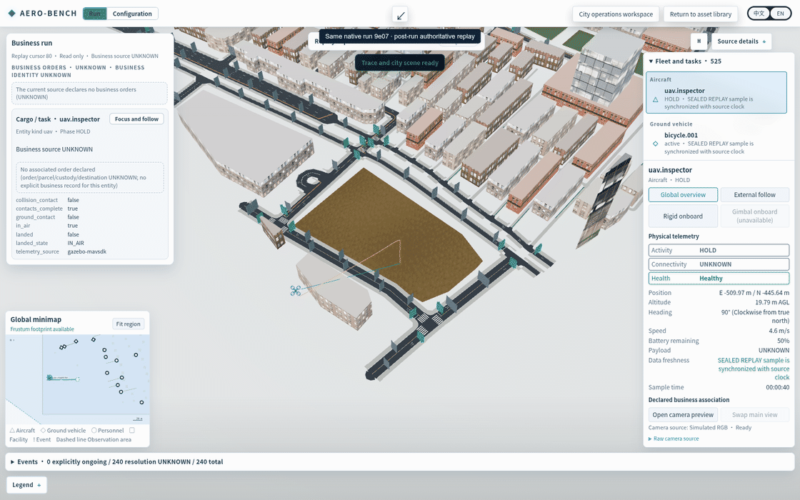

These browser captures show native run `9e07a000f35961e5d4bca89553729a8e743143781aad6d213fed722abfd324fd` after its authoritative trace was sealed at tick300 /150s. This is read-only post-run review, not another native execution or a recovered live Control session.

The GIF uses 20 actual ready browser screenshots: ticks80–260 every10ticks, then tick300. Display timing is accelerated (350ms per frame; terminal frame1800ms). It is a stepped screenshot GIF, not continuous screen recording. It does not record configuration editing or the original Start operation. The four standalone PNGs show ticks120,240,300 and a1280×900 narrow view at tick240; other captures are1600×1000. Each PNG is below1MiB.

`pose-correlations.json` matches inspector east/north and sample time to the same authoritative aircraft sample. ENU up and AGL retain separate meanings. Original textured BENCH city assets are visible; the aircraft uses a distinct screen marker, and its native entity GLB binding remains unavailable. Business identities remain UNKNOWN because this inspection run declares no logistics orders. Scene/texturesready and measured body/viewport sizes are in `visual-receipt.json`; aborted asset requests and missing-pack counters are retained there, not hidden.

This checks the same-run sealed viewer and common renderer. It does not certify live Control reconnection, its rate-limited asset path, every configuration operation or verifier goal success. The raw public trace, original GLB/map assets, sensor images and private ledger remain on the server and are not included here. Source revisions and artifact hashes are in the companion files.
