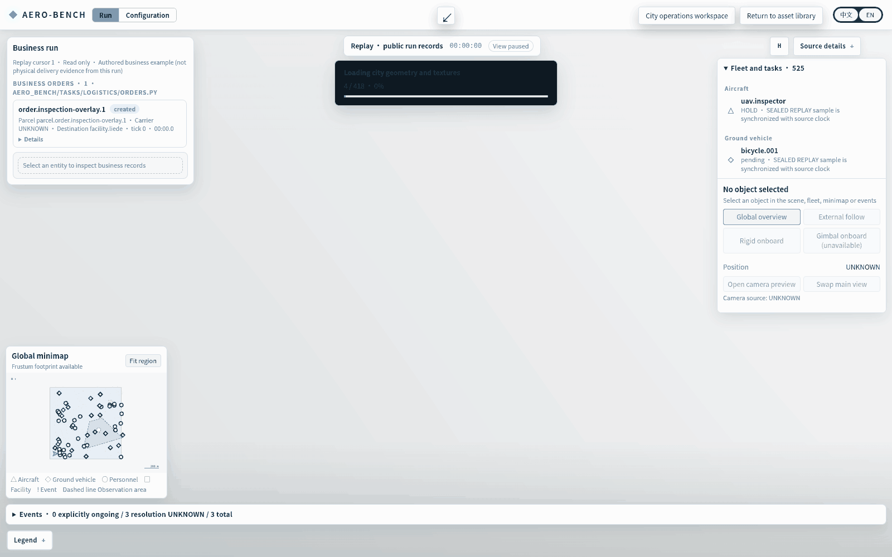
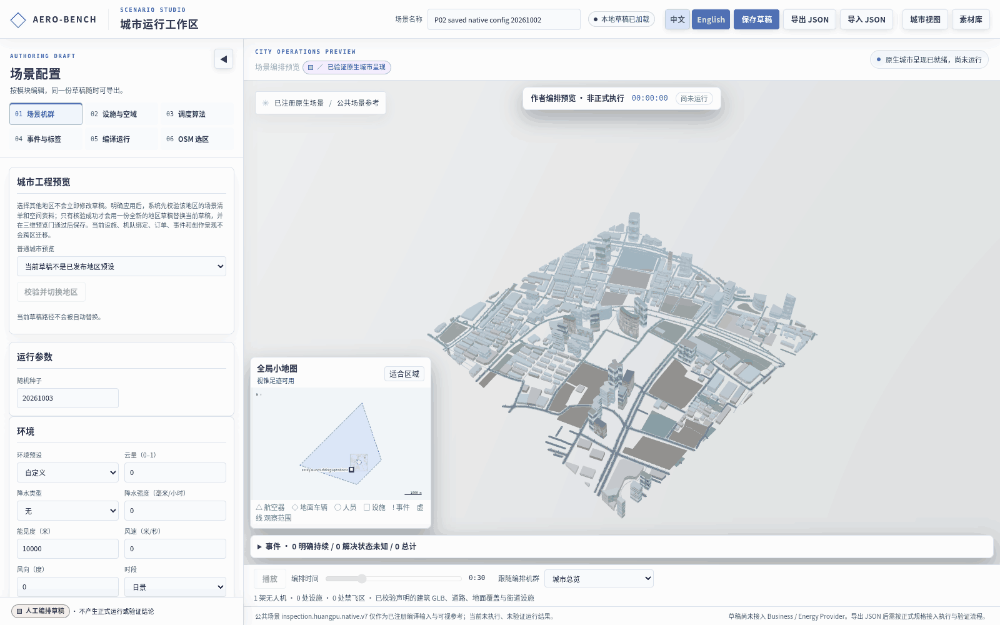

# P02 configuration round-trip with the original BENCH scene

These are screenshot-step GIFs assembled from actual browser PNGs, not continuous operation recordings. The browser edits seed 20261002 to 20261003, saves, reloads the edited value, switches language, restores the approved draft, loads its matching compilation, and returns to the exact original sealed-v8 replay. No new native simulation is shown.

Five frames, 12 seconds, 1600 × 1000. The first Run frame waits for both the original city and the replay's declared scene assets to finish loading. The subsequent frames show the editable Studio and the saved value after reload.

Three frames, 7.2 seconds, 1600 × 1000. The final Run frame also waits for complete scene loading. Both GIFs use a 128-color palette; original PNGs remain alongside them. No models, materials or map geometry were redrawn.

## Readable frames and assertions

- [Initial fully loaded Run](01-run-before-configuration.png)
- [English Studio](02-studio-editor-en.png) and [Chinese Studio](06-studio-editor-zh.png)
- [English narrow Studio](08-studio-narrow-en.png) and [Chinese narrow Studio](07-studio-narrow-zh.png)
- [Edited value retained after reload](05-edited-draft-reloaded.png)
- [Matching compiled handoff](09-matching-compiled-handoff.png)
- [Fully loaded original replay restored](10-original-replay-restored.png)
- [Operation evidence](operation-evidence.json), [capture script](capture-script.mjs), and [source/artifact hashes](manifest.json)

The operation evidence records scene readiness, texture readiness, rendered triangle count, loading-bar state, replay cursor and viewport dimensions. The return preserves the original replay URL and cursor. The editor scrolls within its panel; neither tested viewport has body overflow. The empty selection panel stays collapsed, and preview is labeled Not run.

This refresh changes the capture's readiness assertion, not the application source or scene. The earlier c6bd9fbb captures remain available in Git history. The 49 focused frontend checks, TypeScript checking and production build were completed for that application version; they were not rerun or claimed as new evidence here. Independent pixel acceptance remains with the parent reviewer.

## Native execution remains separate

Saved draft `68c049b28e15d4e2886b36ff222361e6bfb059b4ff8b23339dd7e0a4fa7f368f` matches compilation `a504dba5ab6c8c2183b5ce419173f89bd03289860e62ffeee760ff529417c610`, whose native-v7 run is `9e07a000f35961e5d4bca89553729a8e743143781aad6d213fed722abfd324fd`. ControlRunManager's configuration readback is established; simulator startup is not. The served sealed-v8 replay is a different run.

[Exact compilation-bound startup instructions](operator-start.md) use only the existing operator token and CSRF variable names. Both are absent from the inspected coordinator launcher environment; user-side prior configuration is unknown. The coordinator has not generated a bootstrap pair or requested a new run. Normal startup issues run-scoped token/CSRF credentials. Authentication stays enabled, and the active v8 service is preserved. The integration branch `feature/p02-bench-native-integration-20261005` is local only; it has not been uploaded. Full edit-to-new-native-execution GIF acceptance remains blocked on an existing authorized operator context.
