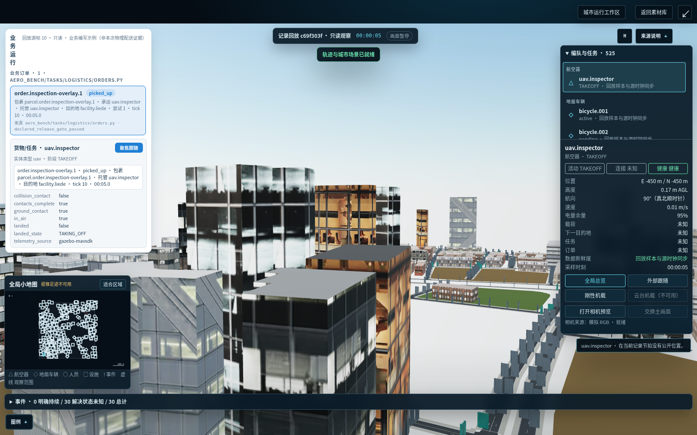

# Integrated business identity checkpoint

This is a work-in-progress capture, not final visual or simulator acceptance.

The existing `PublicTraceApp` / `PublicTraceMap` renderer and original BENCH model/city assets are retained. No original model or map assets are uploaded here.

- Source checkout HEAD: `ea295073cdd310a31fa2e29317a3571bc716bb87`, plus uncommitted integration edits in `frontend/src/app.ts`, `map.ts`, `p02-entity-overlays.ts`, and `p02-view.css`.
- Scene presentation: `city-presentation/jingan-engineering-preview-v3.json`.
- Replay: `inspection.huangpu-native.formal.v8`, run `c69f303f0be963d9fd4c393d88f7cb61d3508c539f080924d30b0d6f19f7deba`, tick 10 / 5 seconds.
- Logistics overlay: `authored_business_fixture`, produced through `LogisticsOrdersService`; the inspection run did not physically perform logistics. The visible banner says this. Pickup/handoff/delivery physical evidence remains UNKNOWN.
- Explicit identities: order `order.inspection-overlay.1`, parcel `parcel.order.inspection-overlay.1`, carrier `uav.inspector`, custody `entity:uav.inspector`, destination `facility.liede`.
- Measured browser outcome: GLB scene ready, one bound order, zero unbound order rows, no page errors, no body overflow, selected carrier agrees with the order panel. Capture took 95.078 seconds.
- Re-run verification: 31 frontend identity/replay tests and 117 business lifecycle tests passed; frontend typecheck and production build passed. Python emitted warnings about previously existing temporary directories it could not remove; no permissions were changed.

Remaining work: the inherited dark right-hand inspector, close building-heavy camera, and unavailable selected-object map position are visible. A business overlay is not evidence of physical delivery or verified cross-city coordinate alignment. State units/rule details and actual business-provider linkage remain incomplete. Parent visual review is required. This screenshot must not be presented as final acceptance or a real logistics execution.
