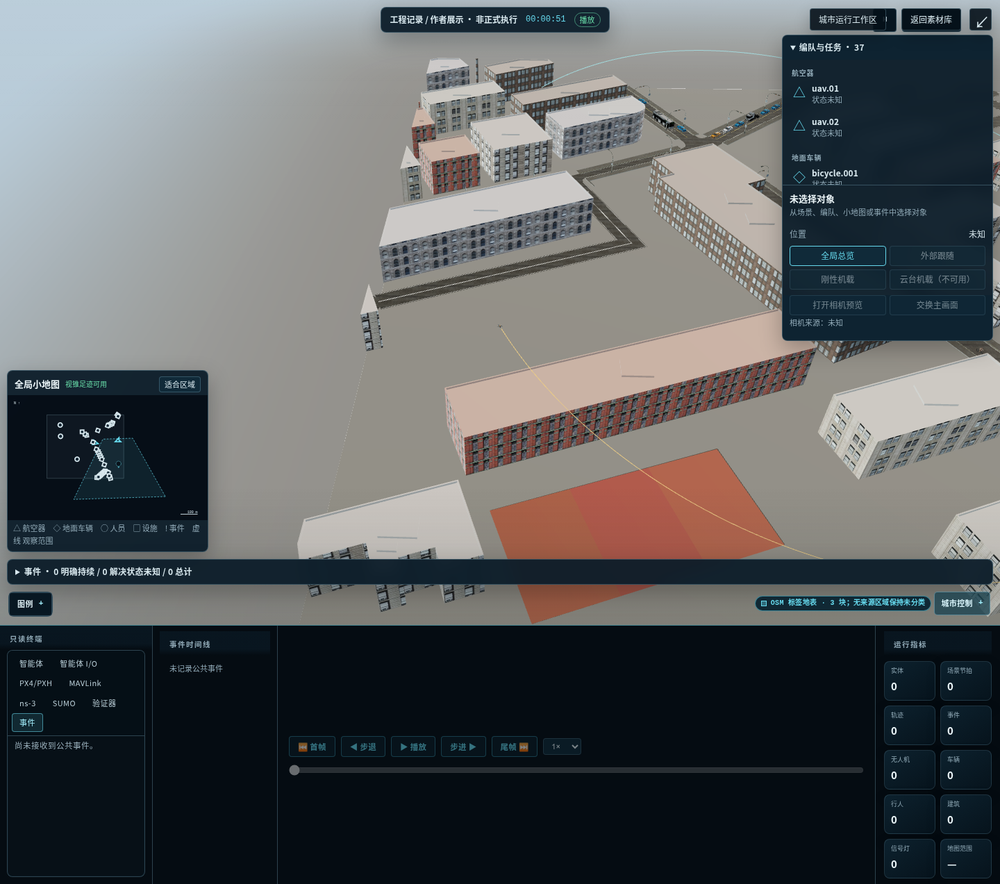
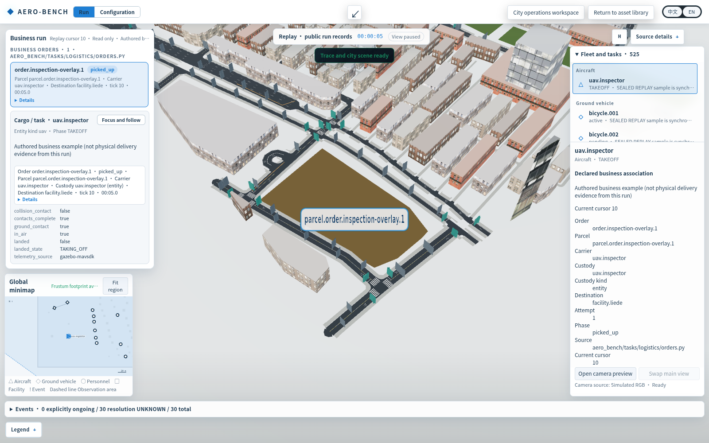
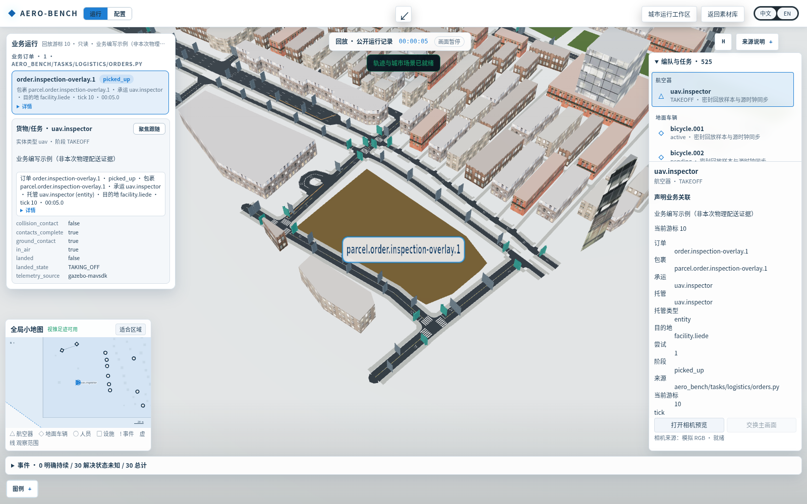
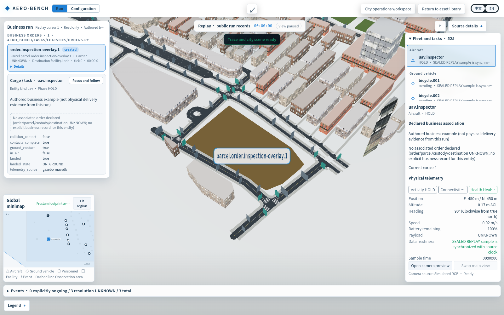
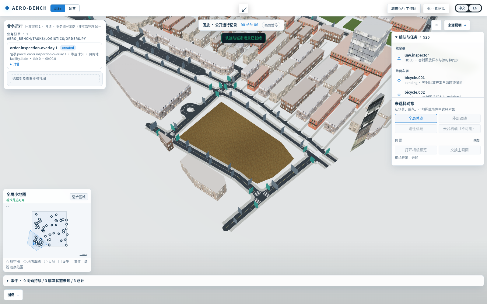
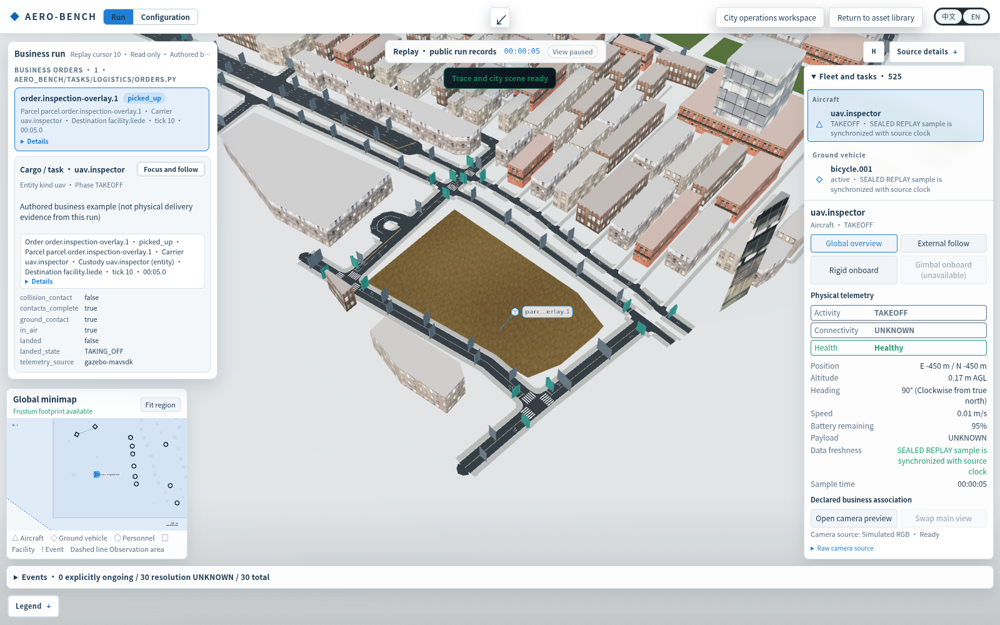
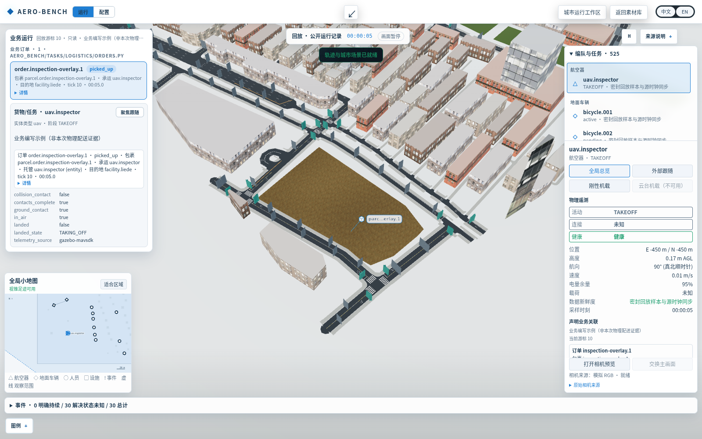
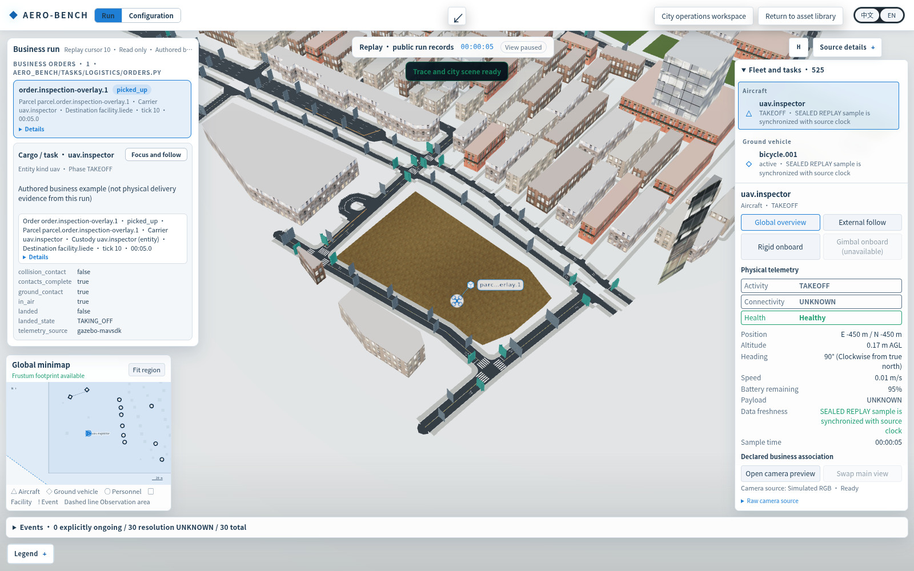

# P02 existing BENCH scene review

The existing BENCH GLB/city renderer is retained. These project-scene screenshots contain no account data, credentials, private host addresses or personal data. Original model/map assets and raw trace files are not included.

## Original scene

Original source HEAD: `ea295073cdd310a31fa2e29317a3571bc716bb87`. Entry: `frontend/index.html` → `frontend/src/main.ts` → `PublicTraceApp` → `PublicTraceMap`. Asset loaders: `entity-visuals.ts` and `city-asset-cache.ts`. Scene configuration: `frontend/public/city-presentation/jingan-engineering-preview-v3.json`.

## Current integrated view, v5

**IN PROGRESS; parent pixel review required.** This is sealed flight replay with explicitly authored business associations. Parcel/order/custody labels do not establish physical cargo transport or delivery.

The elevated task-region camera exposes streets/intersections. White/light surfaces, English content, a shared selected-frame business selector and seek clearing were checked. Each screenshot is1600×1000; the body matches the viewport. Current left/right association at cursor10 uses the same order, parcel, carrier/custody and destination, and both panes identify it as authored/nonphysical.

Independent pixel review still finds a large parcel label obscuring the carrier marker, business details pushing telemetry below the visible right-pane section, and truncated English status chips. These images are review evidence, not final visual acceptance. City ground/material quality and broader provider/Atlas activities remain separate unfinished work.

`integrated-v5-provenance.json` records image hashes, source HEAD plus dirty-file hashes, scene/trace/business-source paths and remaining limits. It does not assert that the dirty server source was a clean checkout or that every provider integration is complete.

## Integrated review v6 — in progress

These are actual1600×1000 screenshots from the original BENCH city/building GLB renderer. Terrain textures reuse the earlier BENCH terrain-v1 work. The central brown plot is OSM-tagged construction land, not an invented green area. Business associations remain explicitly authored fixtures.

Follow/seek operation evidence: [start5s](integrated-v6-follow-start-en.png), [forward20s](integrated-v6-follow-moved-en.png), [backward5s](integrated-v6-follow-backward-en.png), [seek zero](integrated-v6-seek-zero-en.png). The current-frame association is cleared on seek to zero.

**Remaining failures:** destination facility has no bound map position; native UAV replay asset is a JSON symbol rather than an aircraft GLB; at20s v6 still pins the parcel to the old carrier after authored facility custody. That last source defect was subsequently fixed, but this gallery intentionally preserves the captured pre-fix evidence. A separate aircraft marker, correct custody anchoring, and source snapshot will be captured next. Configuration edit/save/readback on the same run source remains unproved. No final visual acceptance is claimed.

Image/capture hashes, exact trace/config paths and bounded operation records are in `integrated-v6-provenance.json`. Renderer dirty-source hashes were not frozen before this v6 capture and are explicitly unavailable; the source HEAD does not falsely identify a clean checkout. No model or map assets are uploaded.

## Browser screenshot review copies under1MiB

Original PNG files are retained. The `*-review.jpg` copies keep1600×1000 pixels; there is **no resizing or redraw**. JPEG quality90, no chroma subsampling, is lossy compression only. Every copy is below1MiB. [Derivative manifest](review-image-derivatives.json) records original/copy hashes, sizes and encoding.

Review v6 follow pixels: [start5s](integrated-v6-follow-start-en-review.jpg), [forward20s](integrated-v6-follow-moved-en-review.jpg), [backward5s](integrated-v6-follow-backward-en-review.jpg).

## Integrated review v7 — custody placement correction, in progress

Follow evidence: [start5s](integrated-v7-follow-start-en-review.jpg), [forward20s](integrated-v7-follow-moved-en-review.jpg), [backward5s](integrated-v7-follow-backward-en-review.jpg), [seek zero](integrated-v7-seek-zero-en-review.jpg). At20s the authored record places custody with `facility.liede`. That facility has no position in this actual scene, so the parcel is **not placed** at its old carrier. The independent blue aircraft icon remains at the replay aircraft position. Destination remains unlocated; no coordinates are invented.

Original PNGs use the corresponding filenames without `-review.jpg`, with `.png`. [v7 provenance](integrated-v7-provenance.json) includes the dirty-source hashes frozen before capture. UAV native replay is a JSON symbol, not an aircraft GLB; the screen-space icon does not claim a new model binding. This remains a business association fixture over original BENCH city/GLB replay, not physical cargo delivery. Configuration/run-source wiring and final parent pixel acceptance remain open.
