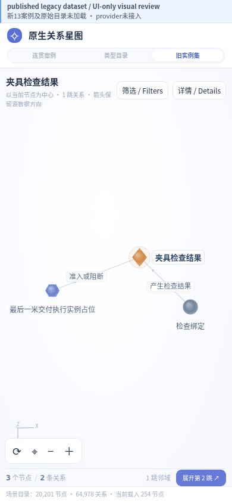
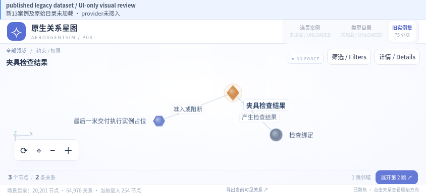
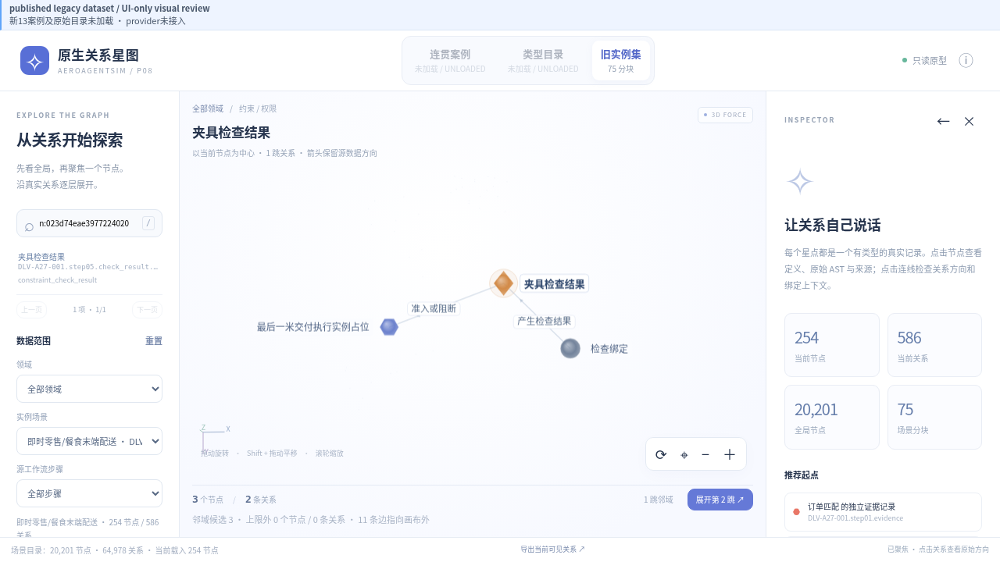

# P08 published legacy UI review

This is the already-public legacy instance dataset and UI-only QA entry. Original1686catalog and accepted13case data are UNLOADED. It does not certify provider integration, rule evaluation or the13case browser suite. No original ZIP, model/map assets or private case data is included.

The coordinator retained the ordinaryFlash partial, released its write ownership, then fixed responsive CSS, the always-visible QA notice and CSS custom-property assignment. Existing force renderer and data are retained.

| Viewport | Document scroll | Graph canvas height | QA notice |
|---|---|---:|---|
|390×844|390×844|610.125px|Visible|
|844×390|844×390|207.734px|Visible|
|1280×720|1280×720|417.9375px|Visible|

The500px graph target is met in portrait390×844. Landscape does not claim500px inside a390px viewport. Panels/drawers scroll locally; body does not scroll.

[Dense initial desktop](initial-legacy-desktop.png) · [Selected rule](selected-rule-desktop.png) · [Selected edge](selected-edge-desktop.png) · [Mobile details drawer](mobile-details-open.png).

`browser-report.json` records drag rotation, Shift pan, wheel zoom, keyboard rotation/search/Escape, node/edge inspection, drawer toggles, exact scroll/canvas sizes and computed legend fill/border colors. The hollow predicate legend intentionally uses a colored border with transparent fill. Page errors and failed requests are empty. Ten focused code tests pass.

Independent pixel review passes viewport containment, notice, colored legend and centering within this scope. Dense initial labels and a selected-edge tooltip that covers an endpoint remain follow-up items; no final whole-P08 acceptance is claimed. `independent-pixel-review.json` preserves that review. Parent visual review is still required. Exact source/image hashes are in `provenance.json`.
