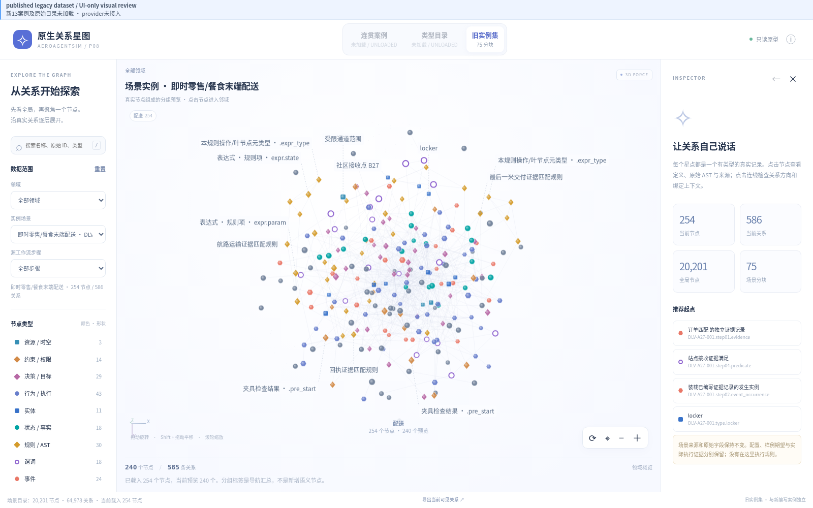
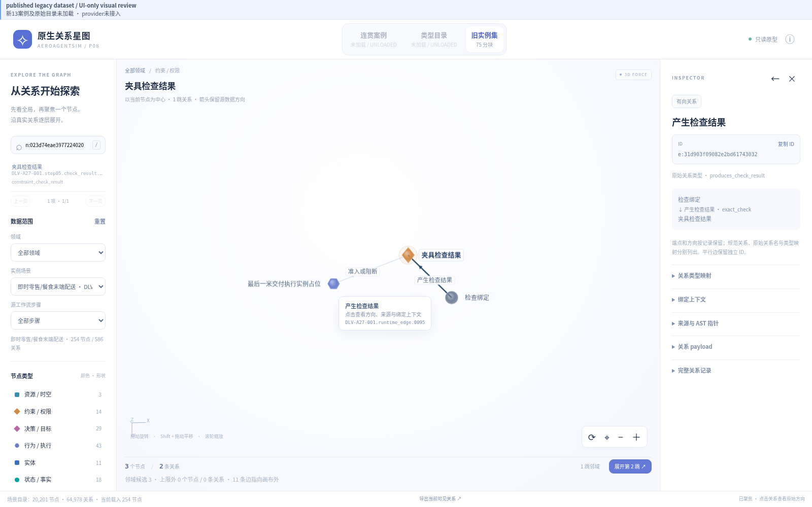
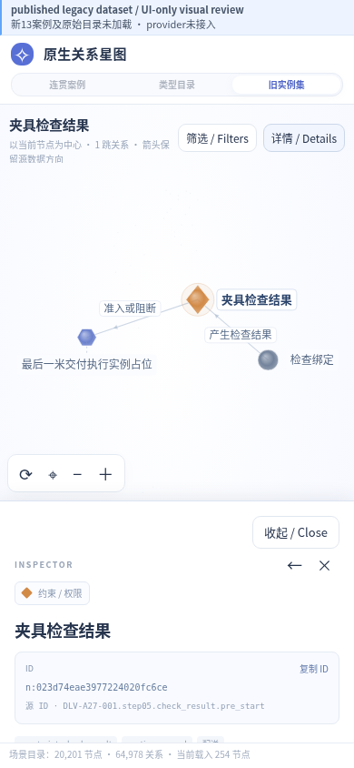

# P08 legacy UI v9 review

The same published legacy dataset and renderer remain in use. Native13 cases, the original catalog and provider integration are unloaded. This delivery includes no private case data, original ZIP or model/map assets.

The narrowed fixes limit overview labels to twelve semantic priorities, disambiguate repeated names with existing IDs, show full selected/hover text, and place the edge tooltip clear of endpoints. Mobile details fit the unoccluded graph while preserving user orientation. Zoom, explicit fit, keyboard and resize after a manual change retain that change. Camera controls remain above the drawer.

All eight images are actual browser captures below1MiB. The report records pointer rotation/pan, wheel/keyboard/zoom/fit, search, node/edge inspection, drawer behavior and three viewport sizes. Focused code tests and independent pixel/source review pass. This closes these scoped UI findings; it does not certify native13 cases or providers. Parent visual review remains separate.

[Selected rule](selected-rule-desktop.png) · [Portrait390×844](viewport-390x844.png) · [Landscape844×390](viewport-844x390.png) · [Desktop1280×720](viewport-1280x720.png)

Exact source/image identities are in `provenance.json`. Source patches are a QA reference under `source/`; this is not a root application merge. Prior review images and failure evidence remain unchanged.
