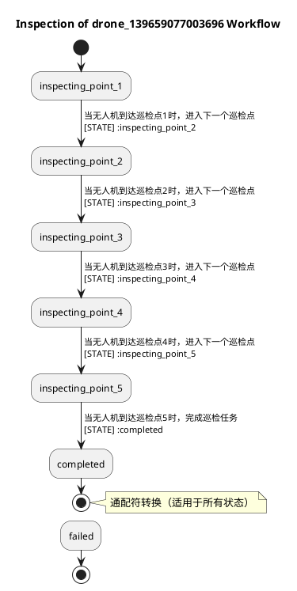
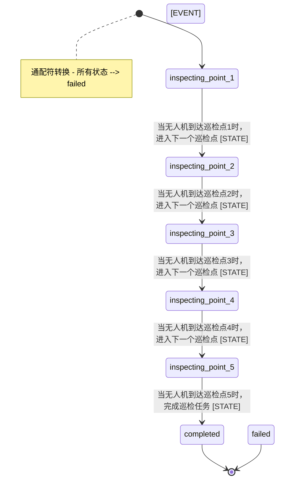

# 巡检工作流活动图

## PlantUML活动图

```plantuml
@startuml
title Inspection of drone_139659077003696 Workflow
start
:inspecting_point_1;
-> 当无人机到达巡检点1时，进入下一个巡检点\n[STATE] :inspecting_point_2;
:inspecting_point_2;
-> 当无人机到达巡检点2时，进入下一个巡检点\n[STATE] :inspecting_point_3;
:inspecting_point_3;
-> 当无人机到达巡检点3时，进入下一个巡检点\n[STATE] :inspecting_point_4;
:inspecting_point_4;
-> 当无人机到达巡检点4时，进入下一个巡检点\n[STATE] :inspecting_point_5;
:inspecting_point_5;
-> 当无人机到达巡检点5时，完成巡检任务\n[STATE] :completed;
:completed;
stop

note right: 通配符转换（适用于所有状态）
-> [EVENT] :failed;
:failed;
stop
@enduml
```

## Mermaid状态图

```mermaid
stateDiagram-v2
    [*] --> inspecting_point_1
    inspecting_point_1 --> inspecting_point_2: 当无人机到达巡检点1时，进入下一个巡检点 [STATE]
    inspecting_point_2 --> inspecting_point_3: 当无人机到达巡检点2时，进入下一个巡检点 [STATE]
    inspecting_point_3 --> inspecting_point_4: 当无人机到达巡检点3时，进入下一个巡检点 [STATE]
    inspecting_point_4 --> inspecting_point_5: 当无人机到达巡检点4时，进入下一个巡检点 [STATE]
    inspecting_point_5 --> completed: 当无人机到达巡检点5时，完成巡检任务 [STATE]
    completed --> [*]
    %% 通配符转换（适用于所有状态）
    note right of [*]: 通配符转换 - 所有状态 --> failed
    Note: [EVENT]
    failed --> [*]
```