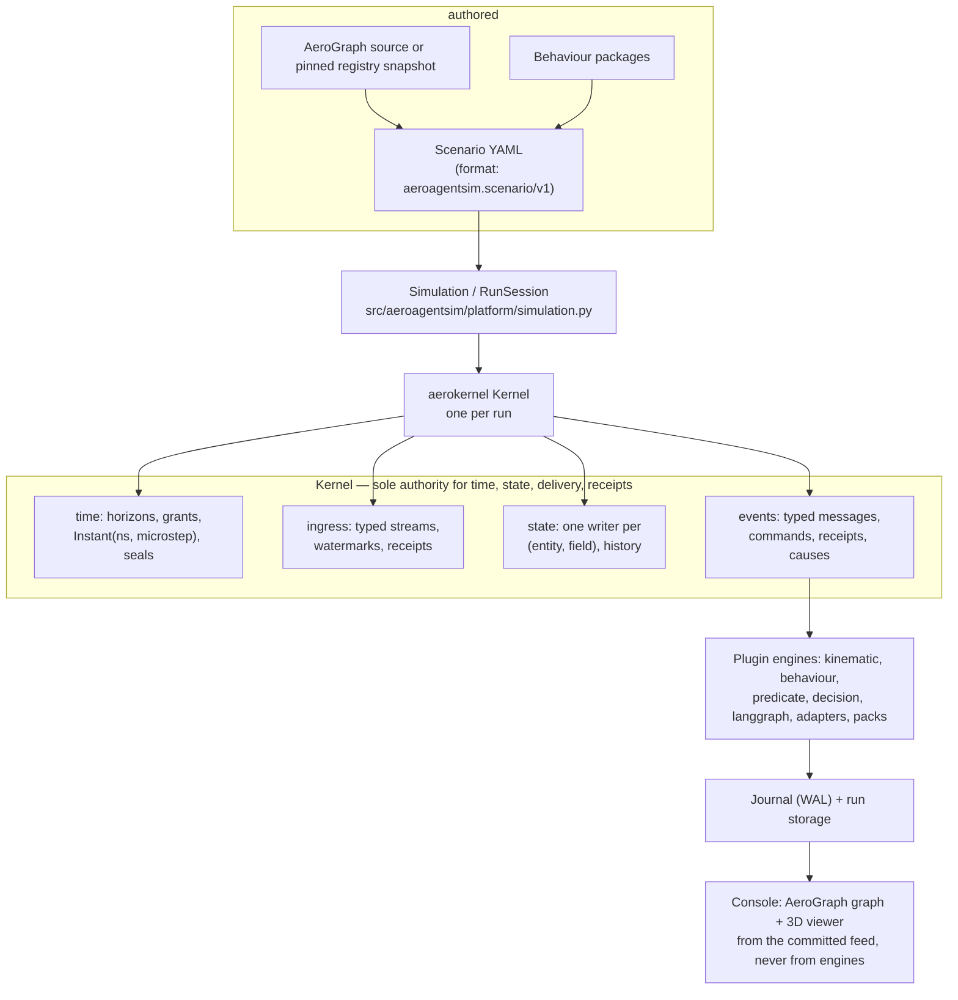

# Architecture

AeroAgentSim runs every scenario on **one shared DES kernel** (the independent
`aerokernel` package). The kernel owns simulation time, committed state, event
delivery and action receipts. Everything else — physics, weather, traffic,
agent decisions, orchestration chains — is a plugin engine inside that single
coordinated run. External services may have their own execution threads and clocks; their results enter the shared runtime through declared coordination contracts.

## From configuration to a running simulation



- **Registry + scenario.** A scenario YAML references a pinned registry
  snapshot and declares entities, initial facts, writer bindings, engines and
  ingress streams. The loader (`../../src/aeroagentsim/scenario/loader.py`)
  resolves packages and validates writer ownership before anything runs.
- **Simulation / RunSession.**
  [`Simulation`](../../src/aeroagentsim/platform/simulation.py) builds the
  engine catalog, allocates partitions and binds one `Kernel`.
  `RunSession` wraps it with run-directory storage, a manifest and a fixed
  advance schedule.
- **One kernel.** All engines share kernel time and the committed-state
  contract. A field has exactly one authorized writer; business and physical
  engines may own different fields of the same entity.
- **Journal.** Every committed fact, event and receipt is journaled. Replay
  reconstructs recorded state with zero engine, model, RNG or sensor calls.

## Provenance: lean vs full

Provenance controls how much causal detail the journal carries — it is a
data-collection/debug choice, not a semantic mode. Ownership, typed receipts,
watermarks and time seals apply in both modes.

| Mode | Records | Use it for |
| --- | --- | --- |
| `lean` (default) | Each engine output cites its invocation, which records delivered inputs and the read cut. | Ordinary runs; smaller journals. |
| `full` | Adds explicit read-vector auditing per output. | Debugging disputed results; auditing who read what. |

Set it with `provenance: full` in the scenario, `Simulation(...,
provenance="full")`, or `aeroagentsim run ... --provenance full`. An override
is pinned in the saved scenario copy and the run manifest.

## Pauses and stops: three distinct things

- **Simulation pause** (live runs): the worker process pauses host execution at
  the current committed cut. Simulated time and physical integration are
  frozen; pending ingress stays queued. Resume continues the outstanding
  boundary and starts a fresh wait budget — paused wall time does not consume
  it.
- **Playback pause** (viewer): pauses only the display clock in the console.
  It never stops or advances the simulation; a live run keeps committing
  while you inspect a frozen historical cut.
- **Clean stop** (`POST /v1/runs/{id}/stop`): interrupts a wait promptly and
  ends the run as `stopped`; the kernel records `run_stop` at the actual
  committed cut without manufacturing input or a seal. The journal stays
  complete and replayable up to that cut.

A run waiting for a live source reports status `waiting_for_input` with the
pending stream IDs and target time. If the stream declared a `timeout_s`, the
run ends as `input_timeout` with a closed, replayable journal.

## Agent inference blocks simulated time

Decision plugins (`decision`, `langgraph`) run as ordinary DES partitions.
While a model call is in flight, the coordinator stays at the scheduled
simulation instant: no other engine advances, and other state is not
mutated. Wall latency is recorded separately from simulated time; there is
no second motion thread that advances state during inference. Budgets
(`wall_timeout_s`, `max_rounds`, `max_calls`, `max_tokens`) bound each
decision, and a late reply cannot publish commands.

## Deterministic replay

Replay is journal replay, not re-simulation:

```bash
aeroagentsim replay runs/<run-directory>
```

It calls no engines, model providers, native simulators, RNG or live clocks.
An incomplete or faulted journal replays as incomplete or faulted — never as
synthetic success. Run ordering is fully pinned (authored priorities, stable
instance IDs, kernel delivery order), so the recorded prefix reconstructs
exactly regardless of wall-clock timing of the original run.

## Where to go next

- [AeroGraph registry](aerograph.md) — how types and fields reach the kernel.
- [Predicates](predicates.md) and [Behaviours](behaviours.md) — the two
  orchestration layers.
- [Plugins](plugins.md) — engine ownership contracts.
- [Agents](agents.md) — model-driven decisions.
- [Runs](runs.md) — lifecycle, HTTP control and run storage.
- [Views](views.md) — the console you inspect all of this in.
