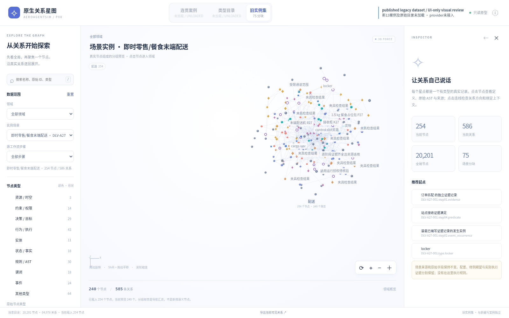
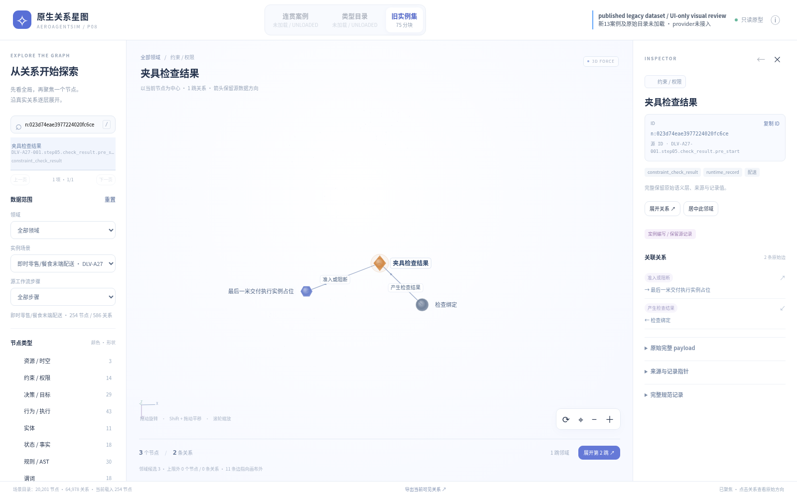
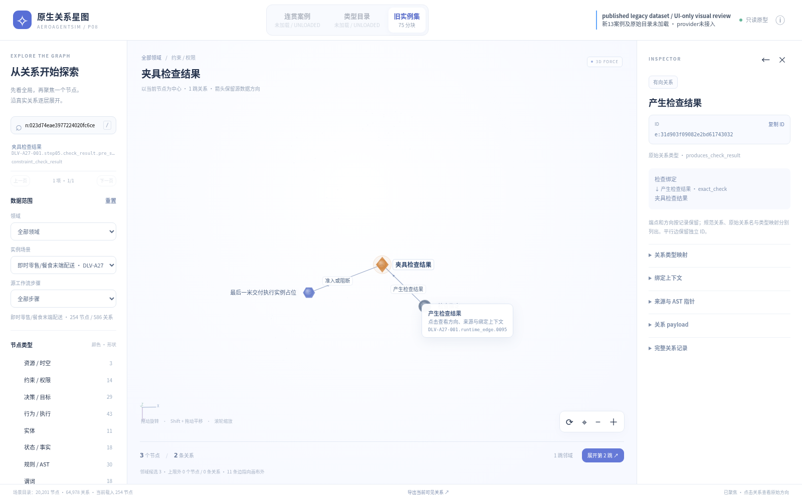
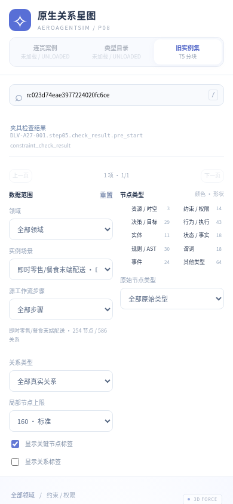

# P08 public legacy UI review

This is **published legacy dataset / UI-only visual review**. It uses only already-public code and data. It is not acceptance of the private original catalog, accepted thirteen cases, or native-provider integration.

- UI source: `backup/p08-star-ui-code-20261005`, commit `4f9adf6e8b851d3a7b1086fba3d297f1620607a2`, `backups/p08-star-ui-code-20261005/ui/`.
- Legacy data: `backup/p08-graph-20261005`, commit `7ca57707930fc45fdc1d48f32c6470beabf33bb8`, `p08-graph-workbench/data/instances/`.
- QA entry selects `instances`; unavailable datasets are disabled and marked UNLOADED. No private dataset is reconstructed. The original UI modules are unchanged.
- Actual selected scenario: `DLV-A27-001`,254nodes/586edges; initial preview240nodes/585edges. The selected constraint result retains its legacy fixture provenance.

Desktop1600x1000 rotation, Shift-pan, wheel zoom, keyboard rotation, search, node/edge inspector and panel overflow checks pass. Mobile390x844 has no horizontal overflow but **fails full-viewport layout**: page height2085px and graph below initial fold. Mobile QA-scope banner is hidden by supplied CSS. These are open UI defects.

The common renderer projects a3D force layout through Canvas2D; it is not Three.js WebGL. Overview edges/labels are pale and compact; focused constraint view is clearer. These images contain no BENCH city/model assets.

## Actual browser images

`report.json` records browser checks and exact image hashes. These are actual supplied-renderer screenshots. No image generation or mock screenshot was used.
