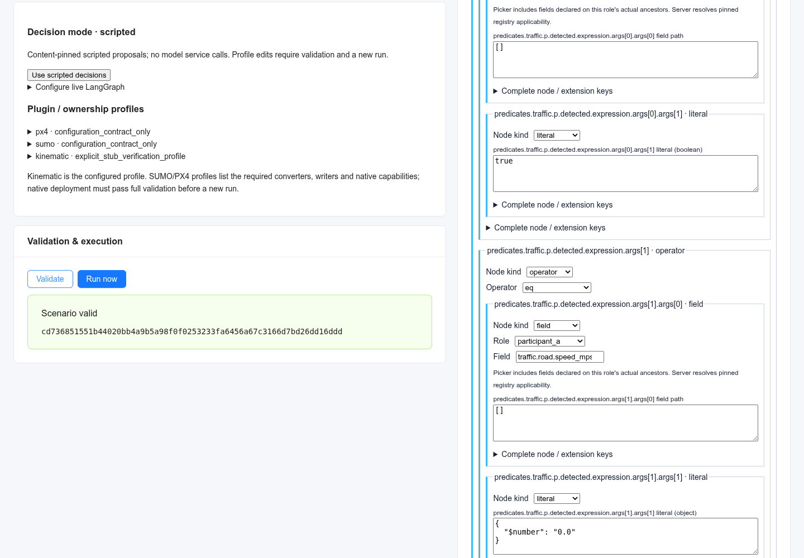
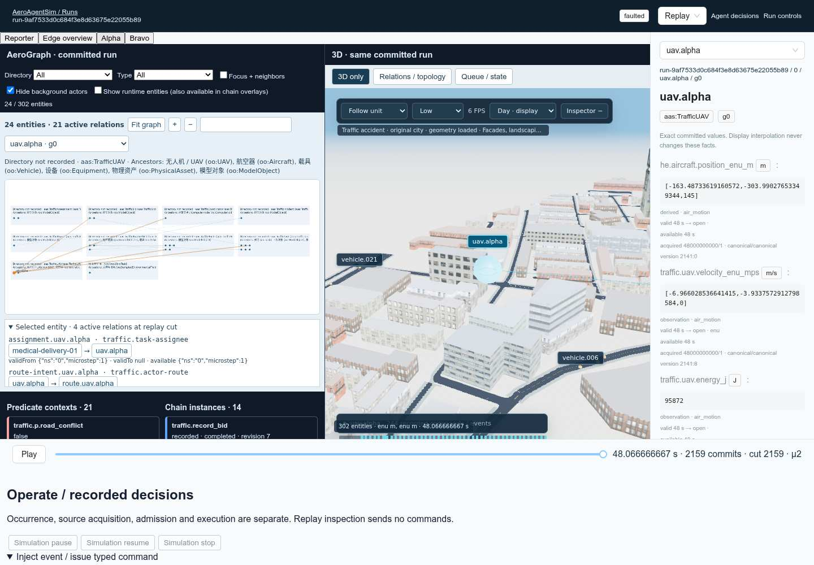
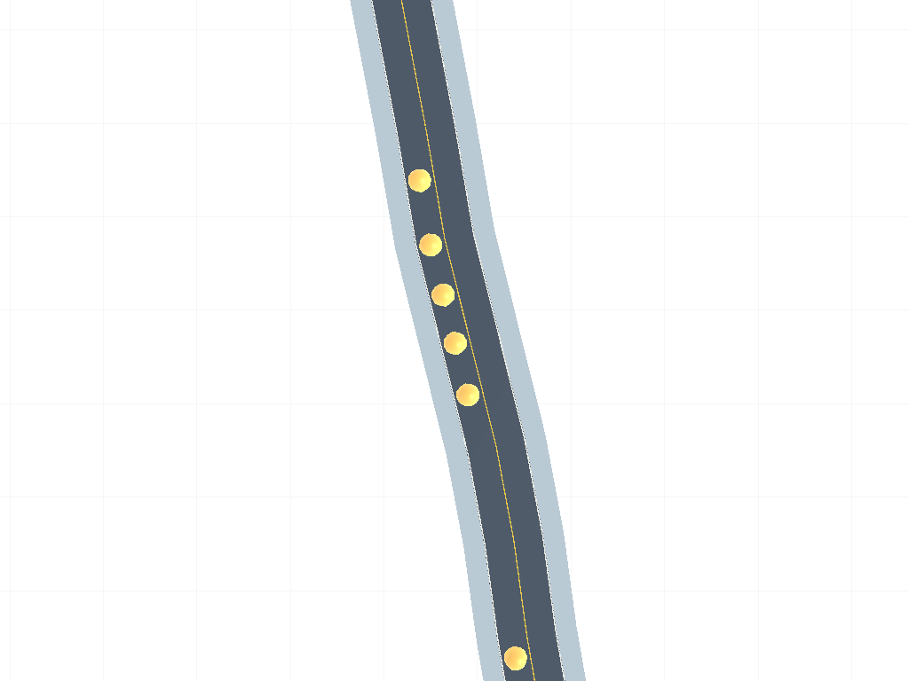

# Configuration and synchronized run console

Task E extends the existing Studio, Runs and AgentConsole routes. All execution
uses `/v1/runs` and one core runtime. The editor does not evaluate predicates or
simulate behaviour in the browser. See [RUNTIME §§5–6.1](RUNTIME.md),
[demo workflow §7](demo-traffic-accident.md), [predicates](predicates.md),
[observations](observations.md) and [LangGraph](langgraph.md) for the underlying
contracts.

## Configure, validate, run

1. Open `/studio?api=<service-origin>`, create/open a workspace and configure the
   registry, entities, relations, fields and writer bindings. **Traffic accident (demo)** copies the actual shipped scenario and pinned files into
   this workspace. It replaces this draft; it does not change any running run.
2. In **Behaviours**, add a package or open its pinned reference as an inline
   draft. Pinned dependencies are rebased to the same workspace files when moved
   inline; the original package export remains unchanged. Pick bound role types, inherited fields and relation descriptors from
   the real catalog. Predicate AST forms retain complete nodes and unsupported
   operators in raw JSON. The server determines dialect support, applicability
   and history requirements.
3. Author a predicate such as `eq(task.phase, "queued")`. Create a chain with
   `trigger: {predicate: ready, edge: entered}`, bound task roles, explicit states
   and transitions. A transition can guard on `ready`, set a field owned by this
   engine, emit a typed event or issue a configured command. Subsequent committed
   updates can change predicates and trigger later transitions. Pick **Connect
   states**, then source and target in the state-machine graph; edit the created
   transition's trigger, guard, priority and ordered actions in its form.
4. Configure bindings, multiplicity, conflict rules and injection points. Their
   structured forms and complete declaration JSON edit the same package object.
   The raw package, AST, transition and action editors retain unknown siblings.
   Invalid raw buffers block saving/validation; switching away abandons that
   unsaved invalid buffer. YAML import/export runs through the server, normalizes
   formatting/comments and exports the authored package and layout. Duplicate YAML
   keys are rejected. Graph layout metadata is separate from scenario semantics.


5. In **Engines / ownership**, inspect explicit entity/type-field writer
   bindings. Select a replacement partition/profile and its actual catalog
   configuration schema. Available kinematic, SUMO, PX4, weather and other
   installed profiles are listed from the catalog. Advertised field/command and
   required-plugin contradictions block applying a replacement. Missing
   capability descriptors remain visibly unverified and require full server
   validation; native availability is not inferred from a plugin name.
6. **Validate** checks the full scenario through the actual loader/runtime.
   Bound package validation uses the real scenario compiler; **Validate** unlocks **Run now**. Every model edit invalidates
   validation. Start the validated draft, then **Open run console**. Profile and
   writer changes create a new run; there is no runtime hot swap.

The AST editor uses Q6's operator vocabulary. Numeric kind matters: behaviour
float tokens use `$number`, unsafe integer tokens use `$integer`; transport
expands these to real JSON numbers before Python parses them. A literal reserved
one-key map can be escaped with `$record`. `null`, false, unsupported data and
large integers remain explicit. No missing value is replaced with zero/false.

## Operate and inspect one run

`/runs/<service-run-id>?mode=live&api=<service-origin>` shows AeroGraph and 3D
side by side. The graph groups real entities by directory/type and draws actual
relations; nonspatial task, compute and environment entities are included. Use
Directory/Type filters and **Focus + neighbors**, pan/zoom or **Fit graph** for
larger scenes. Predicate context cards and chain instance cards link to the same
entity identities. True, false and unknown remain distinct; unknown diagnostics,
evaluation interval, read cut and source stamps remain inspectable.


This screenshot is a test fixture with three entities, not a traffic-accident
runtime result. Full-resolution originals are under
`/tmp/aas-q/e/screenshots/`. No default/demo facts enter production feeds.

A session's `TemporalFeedStore` owns the selected identity
`{runId, epoch, id, generation}`, live-follow and bitemporal cursor. Both views
use the same store and playback clock. **Seek launch → moving**, a decision
record's cut or a photo's source cut freezes both views at the same journal
prefix, including same-nanosecond microsteps. New live commits extend available
history without moving a frozen cut. **Follow live** immediately seeks the
latest committed cut. Display interpolation never changes recorded facts.

Simulation pause/resume/stop is in **Run controls**; timeline Play/Pause controls
playback independently. Operational receipts show requested action versus
observed effective run status at a safe boundary. In replay, operational controls
are disabled. The ingress form selects an actual registered command or declared
injection point, renders its typed payload schema and requires an explicit
occurrence, stream, source clock/mapping and acquisition numerator/denominator.
The behaviour injection envelope is `{injection_point, payload}`. **Admission
receipts** report accepted/rejected ingress; **Execution receipts** are actual
recorded command receipts at the selected cut. Neither admission nor stored
bytes establish business success.

Decision/LangGraph/tool messages preserve their typed payloads and subject
links. **Agent decisions** opens the same run, identity and selected prefix in
AgentConsole. A cause/record seek moves the shared views. Transport failures stay
visible when a live connection retries; they do not create empty successful data.

**Artifacts / photos** lists actual D storage records and opens stored
PNG bytes. Captures carry plain asset IDs; the backend validates the PNG format
and request correlation.
Publication is shown only when a configured capture writer's asset/request
fields match the stored request at this cut. Seek follows the recorded source
cut. Storage, journal publication and chain/task acceptance are distinct.

## Authoring API additions

Paths are relative to `/v1/studio`:

| Method and path | Behavior |
| --- | --- |
| `POST /workspaces/{id}/templates/traffic-accident` | Copy actual shipped inputs into the draft |
| `POST /workspaces/{id}/behaviours` | Append/replace `{index?, package or yaml, layout?}`; layout-only edits supported |
| `GET /workspaces/{id}/behaviours/{index}/export` | Canonical YAML, original model, rebased inline model/diagnostics, hashes, layout |
| `POST /workspaces/{id}/behaviours/{index}/validate` with `{}` | Saved package compiler diagnostics with authored source/path |
| `GET /runs/{service-run-id}/configuration` | Actual pinned scenario, kernel run ID, WAL epoch and resolved bindings |

Pinned package/import references must remain inside this workspace and match
SHA-256. Imports cannot widen the allowed data collection scope. `/types` also
returns the actual relation source descriptors; catalog factory capability
metadata is exposed only when the installed factory advertises it.

## Exact capture bridge

`/runs?capture=1&capture_assets=<manifest-url>&api=<service-origin>` installs
`window.aeroCapture.render({request, service_run_id, label?})`, compatible with
D's browser recorder call. The bridge reads the real capture request's committed
scene prefix and actual WAL identity, checks actor generation/type and exact
`source_cut.instant`, renders through the existing Three.js assets/entity/scene
code, and returns `{request, png_data_url}`. It never operates a simulation.

The manifest at `capture_assets` lists plain asset IDs and source URLs:

```json
{"format":"aeroagentsim.capture-assets/v1","asset_id":"traffic-city-assets/v1","environment":"viewer-default/v1",
 "files":[{"url":"/assets/vehicle.glb","asset_id":"city/vehicle.glb"}]}
```

The compatibility field `asset_digest` carries the manifest's plain asset ID.
All required model, city, road and HDRI URLs must be listed and available.
The frontend session must adopt these descriptors and remove its content-hash
checks; see [CHANGES-FOR-FRONTEND.md](../CHANGES-FOR-FRONTEND.md).
Camera supports `revision`, optional
`preset`, explicit `eye`, `target`, `fov`, `frame` (`enu` or `render-world`), and
optional `near`/`far` (renderer profile defaults 0.15/16000). A nonspatial actor
requires an explicit `anchor`; eye and target remain absolute coordinates in the
specified frame. Unsupported cameras, missing pose/assets, mismatched identity
reject capture. A recorder label is drawn into PNG pixels.
The capture bridge has no model/city placeholder fallback.

## Integration boundaries

The real compiler is integrated. Package validation uses the bound scenario,
including registry, owners, binding matches and native capability checks. There
is no missing-compiler success or shape-only run admission. Float literals in
schema enums, environmental profiles, facts and the capture bridge deadline
are restored from their actual pinned schemas after browser serialization;
integer clocks remain exact. The bridge deadline uses the declared render
command schema, including when validation has not reached a render invocation.

A feed may omit unchanged predicate/chain arrays. Its `readCut.at` coordinate,
sample acquisition fractions, exact revisions and resolved package `document`
wrappers are preserved. Epoch and injection points are read from the actual
pinned run configuration when absent from the header. Missing identities never
select another entity or generation.

## Traffic accident console walkthrough (E2)

Build the frontend once (`cd frontend && npm run build`) and serve it through
`create_app(..., frontend=Path('frontend/dist'), studio_root=...)`. Set
`AEROAGENTSIM_AEROGRAPH_ROOT` to the real source checkout and
`AEROAGENTSIM_CONSOLE_URL` to this service's browser-visible origin. Set
`AEROAGENTSIM_TRAFFIC_ASSET_ROOT` to the original accident demo's `web/assets`
directory. The asset route exposes only files listed in the committed
`inputs/city-manifest.json` and requires them to exist inside the configured asset
root. Meshes remain external; they are not copied into this repository. Missing
files and paths outside that root are explicit errors.

1. Open `/studio?api=<service-origin>` and click **Traffic accident (demo)**.
   This creates a separate draft and copies its real registry snapshot, behaviour
   package and decision fixtures. The behaviour package opens inline. The
   **Entities by AeroGraph type** tab groups the actual draft and edits its typed
   initial fields. Raw scenario/package YAML remains available.


2. Use **Behaviours** to edit predicate ASTs or chain states/transitions. Trigger
   category, guard, action values/payloads and binding declarations have structured
   controls over the same package. Unknown keys remain in raw content and are
   subject to real compiler admission. Package validation now runs in the full
   scenario's registry, writers and capability context; diagnostics retain the
   authored element path.
3. Decision mode starts **scripted**, with an explicit fixture and no model calls.
   **Configure live LangGraph** requires explicit provider URL, model and API-key
   environment variable. It installs a proposal graph with read grants for the
   actual actors/tasks and event grants for reports/bids. The behaviour runtime
   keeps award and state authority. Provider failures produce LangGraph records.
   Profile edits invalidate validation and apply only to a new run. SUMO and PX4
   retain their source profile's `configuration_contract_only` readiness; inspect
   their converters, ownership and capability requirements before using native
   engine configuration.
4. Click **Validate**, then **Run now**. The console opens the new run in live
   mode. Console drafts remove the file-run template's automatic accident timer;
   choose **accident** in the injection form whenever the run is active. The form
   uses the actual incident reference. The console advances its operator ingress
   watermark one authored step at a time and admits commands at the next unclosed
   canonical instant. Closing the page stops that source's progress; inspect the
   recorded watermark/error before taking over an existing operator source.
5. Inspect **Admission receipts** separately from **Execution receipts** and the
   chain's state. Simulation pause/resume/stop controls act at runtime boundaries;
   timeline playback is independent. The graph retains nonspatial objects and
   offers type/directory filters, background-actor filtering and focus/context.
   Runtime behaviour entities are shown in chain overlays by default; **Show
   runtime entities** includes them in the topology.
   **Reporter**, **Edge overview**, **Alpha** and **Bravo** select the actual role
   actors and switch the existing city viewer's camera mode.
6. Select a chain transition to freeze both panes at its journal cut. Use
   **Follow live** to resume following. Decision records and artifact source cuts
   use the same temporal store. **Refresh stored artifacts**, then open the stored
   PNG by its asset ID.
   The current frontend label/checks are pending the changes listed in
   [CHANGES-FOR-FRONTEND.md](../CHANGES-FOR-FRONTEND.md).

City capture uses the built console's `window.aeroCapture` bridge, the real city
mesh/road layer and an `actor-nadir` preset derived from the committed UAV pose.
The camera snapshot uses A2's flat `id/generation/field/position` pose rows and
is checked against the exact requested journal cut; the capture manifest lists
every required city mesh by its source URL and plain ID. It never substitutes
another renderer.
The primitive renderer remains available only through the explicit template
option `{"console":true,"capture_mode":"primitive-test"}` for tests.

The real-backend browser gate is
`AEROAGENTSIM_TRAFFIC_ASSET_ROOT=<original-assets> npx playwright test --config
playwright.console.config.ts` from `frontend/`, after building. It imports and
validates the draft, runs it, injects an accident, waits for award/capture, opens
the stored photo and seeks a shared cut. Screenshots and logs go to
`/tmp/aas-q/e2/`; this gate has no mocked run, ingress, feed or artifact endpoints.

## E2 verification status (2026-10-09)

The real backend/browser gate reaches draft import, full compiler validation,
run admission, typed accident injection and `traffic.award.committed`. Its latest
run (`run-9af7533d0c684f3e8d63675e22055b89`) faults at
48.066666667 s, microstep 2, with `CAUSE_DISPATCH_SCOPE`. Journal record 2159
rejects the `behaviour` and `route_inputs` react intents at `2158:4` and `2158:7`.
The faulting proposal is unpublished. The exact offending cause is not included
in the fault record; investigating retained delivery/receipt causes is a
hypothesis. The complete E2E remains **failed**, with automatic artifact opening
and its final transition-seek step unverified in that run. Behaviour runtime
correctness needs resolution before this gate can be marked green.

A separate read-only browser check of that recorded run selected the actual
`dwell → dwelling` transition at cut 2157; graph and city both reported cut 2157.
The following screenshot is the faulted run in replay, with actual city geometry
loaded and Alpha selected before seeking the transition.



Another read-only renderer check used the real registered request
`incident-capture-01/episode-0` from `run-6f8359c326794b0b9fbb1689efe867f6`,
cut 2230 at 50.066666667 s, microstep 2. It returned a 1024×768 browser PNG and
passed the recorder's request metadata comparison. It did not upload the PNG or
change the original failed execution receipt.



The wiring fixes cover A2's flat pose snapshot, request IDs containing `/`,
strict floating capture deadlines after browser JSON serialization, and kernel
run identity read from pinned configuration. Runtime behaviour entities are
optional topology nodes. Background filtering follows actual task/route
references and relations, preserving context shared with foreground actors.
The source scenario has 71 mobile actors plus 72 tasks and 71 routes; these
nonspatial objects remain available when filters are cleared.

Validation evidence: `npm run typecheck`, 143 tests from the final full Vitest
run, two targeted graph tests after the context filter change, production build,
65 Python tests (`tests/authoring` plus `tests/observations/test_artifact_service.py`),
and ruff/strict mypy on the 12 touched Python files. Live provider calls and native
SUMO/PX4 execution were not exercised. Full command lines, run journals, original
screenshots and the failed Playwright report remain under `/tmp/aas-q/e2/`.
