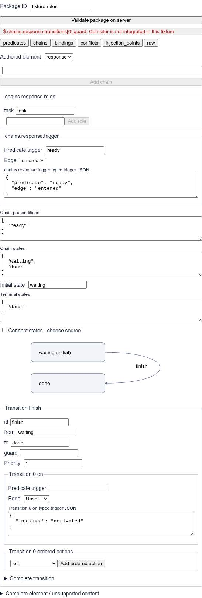
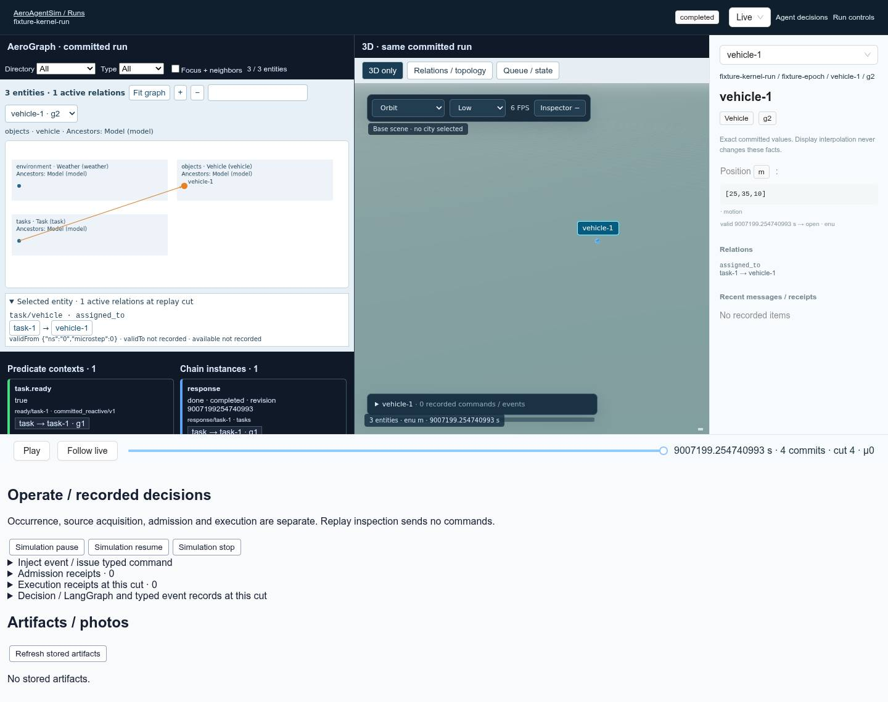

# Configuration and synchronized run console

Task E extends the existing Studio, Runs and AgentConsole routes. All execution
uses `/v1/runs` and one core runtime. The editor does not evaluate predicates or
simulate behaviour in the browser. See [RUNTIME §§5–6.1](RUNTIME.md),
[demo workflow §7](demo-traffic-accident.md), [predicates](predicates.md),
[observations](observations.md) and [LangGraph](langgraph.md) for the underlying
contracts.

## Configure, validate, run

1. Open `/studio?api=<service-origin>`, create/open a workspace and configure the
   registry, entities, relations, fields and writer bindings. **Import traffic
   accident example** copies the actual shipped scenario and pinned files into
   this workspace. It replaces this draft; it does not change any running run.
2. In **Behaviours**, add a package or open its pinned reference as an inline
   draft. Pinned dependencies are rebased to the same workspace files when moved
   inline; the original package export remains unchanged. Pick bound role types, inherited fields and relation descriptors from
   the real catalog. Predicate AST forms retain complete nodes and unsupported
   operators in raw JSON. The server determines dialect support, applicability
   and history requirements.
3. Author a predicate such as `eq(task.phase, "queued")`. Create a chain with
   `trigger: {predicate: ready, edge: entered}`, bound task roles, explicit states
   and transitions. A transition can guard on `ready`, set a field owned by this
   engine, emit a typed event or issue a configured command. Subsequent committed
   updates can change predicates and trigger later transitions. Pick **Connect
   states**, then source and target in the state-machine graph; edit the created
   transition's trigger, guard, priority and ordered actions in its form.
4. Configure bindings, multiplicity, conflict rules and injection points. Their
   structured forms and complete declaration JSON edit the same package object.
   The raw package, AST, transition and action editors retain unknown siblings.
   Invalid raw buffers block saving/validation; switching away abandons that
   unsaved invalid buffer. YAML import/export runs through the server, normalizes
   formatting/comments and reports byte and semantic digests. Duplicate YAML
   keys are rejected. Graph layout metadata is separate from scenario semantics.


5. In **Engines / ownership**, inspect explicit entity/type-field writer
   bindings. Select a replacement partition/profile and its actual catalog
   configuration schema. Available kinematic, SUMO, PX4, weather and other
   installed profiles are listed from the catalog. Advertised field/command and
   required-plugin contradictions block applying a replacement. Missing
   capability descriptors remain visibly unverified and require full server
   validation; native availability is not inferred from a plugin name.
6. **Validate** checks the full scenario through the actual loader/runtime.
   Package-only validation never unlocks **Run now**. Every model edit invalidates
   validation. Start the validated draft, then **Open run console**. Profile and
   writer changes create a new run; there is no runtime hot swap.

The AST editor uses Q6's operator vocabulary. Numeric kind matters: behaviour
float tokens use `$number`, unsafe integer tokens use `$integer`; transport
expands these to real JSON numbers before Python parses them. A literal reserved
one-key map can be escaped with `$record`. `null`, false, unsupported data and
large integers remain explicit. No missing value is replaced with zero/false.

## Operate and inspect one run

`/runs/<service-run-id>?mode=live&api=<service-origin>` shows AeroGraph and 3D
side by side. The graph groups real entities by directory/type and draws actual
relations; nonspatial task, compute and environment entities are included. Use
Directory/Type filters and **Focus + neighbors**, pan/zoom or **Fit graph** for
larger scenes. Predicate context cards and chain instance cards link to the same
entity identities. True, false and unknown remain distinct; unknown diagnostics,
evaluation interval, read cut and source stamps remain inspectable.



This screenshot is a test fixture with three entities, not a traffic-accident
runtime result. Full-resolution originals are under
`/tmp/aas-q/e/screenshots/`. No default/demo facts enter production feeds.

A session's `TemporalFeedStore` owns the selected identity
`{runId, epoch, id, generation}`, live-follow and bitemporal cursor. Both views
use the same store and playback clock. **Seek launch → moving**, a decision
record's cut or a photo's source cut freezes both views at the same journal
prefix, including same-nanosecond microsteps. New live commits extend available
history without moving a frozen cut. **Follow live** immediately seeks the
latest committed cut. Display interpolation never changes recorded facts.

Simulation pause/resume/stop is in **Run controls**; timeline Play/Pause controls
playback independently. Operational receipts show requested action versus
observed effective run status at a safe boundary. In replay, operational controls
are disabled. The ingress form selects an actual registered command or declared
injection point, renders its typed payload schema and requires an explicit
occurrence, stream, source clock/mapping and acquisition numerator/denominator.
The behaviour injection envelope is `{injection_point, payload}`. **Admission
receipts** report accepted/rejected ingress; **Execution receipts** are actual
recorded command receipts at the selected cut. Neither admission nor stored
bytes establish business success.

Decision/LangGraph/tool messages preserve their typed payloads and subject
links. **Agent decisions** opens the same run, identity and selected prefix in
AgentConsole. A cause/record seek moves the shared views. Transport failures stay
visible when a live connection retries; they do not create empty successful data.

**Artifacts / photos** lists actual D storage records and opens content-verified
PNG bytes. The panel verifies SHA-256, response digest header and byte count.
Publication is shown only when a configured capture writer's digest/request
fields match the stored request at this cut. Seek follows the recorded source
cut. Storage, journal publication and chain/task acceptance are distinct.

## Authoring API additions

Paths are relative to `/v1/studio`:

| Method and path | Behavior |
| --- | --- |
| `POST /workspaces/{id}/templates/traffic-accident` | Copy actual shipped inputs into the draft |
| `POST /workspaces/{id}/behaviours` | Append/replace `{index?, package or yaml, layout?}`; layout-only edits supported |
| `GET /workspaces/{id}/behaviours/{index}/export` | Canonical YAML, original model, rebased inline model/diagnostics, hashes, layout |
| `POST /workspaces/{id}/behaviours/{index}/validate` with `{}` | Saved package compiler diagnostics with authored source/path |
| `GET /runs/{service-run-id}/configuration` | Actual pinned scenario, kernel run ID, WAL epoch and resolved bindings |

Pinned package/import references must remain inside this workspace and match
SHA-256. Imports cannot widen the allowed data collection scope. `/types` also
returns the actual relation source descriptors; catalog factory capability
metadata is exposed only when the installed factory advertises it.

## Exact capture bridge

`/runs?capture=1&capture_assets=<manifest-url>&api=<service-origin>` installs
`window.aeroCapture.render({request, service_run_id, label?})`, compatible with
D's browser recorder call. The bridge reads the real capture request's committed
scene prefix and actual WAL identity, checks actor generation/type and exact
`source_cut.instant`, renders through the existing Three.js assets/entity/scene
code, and returns `{request, png_data_url}`. It never operates a simulation.

The manifest at `capture_assets` must have these content-pinned fields:

```json
{"format":"aeroagentsim.capture-assets/v1","environment":"viewer-default/v1",
 "files":[{"url":"/assets/vehicle.glb","sha256":"<64 hex>","byte_count":1234}]}
```

The request's `asset_digest` is SHA-256 of the raw manifest bytes. All required
model, city, road and HDRI URLs must be listed and verified; verified bytes are
pinned as blob URLs before rendering. Camera supports `revision`, optional
`preset`, explicit `eye`, `target`, `fov`, `frame` (`enu` or `render-world`), and
optional `near`/`far` (renderer profile defaults 0.15/16000). A nonspatial actor
requires an explicit `anchor`; eye and target remain absolute coordinates in the
specified frame. Unsupported cameras, missing pose/assets, mismatched identity
or integrity failures reject capture. A recorder label is drawn into PNG pixels.
The capture bridge has no model/city placeholder fallback.

## Integration boundaries and verification

At this worktree's base, Job A is not integrated. The package validation seam is
explicitly marked `compiler_available: false`, `valid: false`. After A lands,
its `compile_package` is imported normally: successful shape compilation returns
`package_valid: true` but still `valid: false` until full scenario validation.
Shape compilation with `build=None` cannot establish registry/ownership/native
compatibility. No other worktree is imported by production code.

Current A wire differences handled here: `readCut.at` (not `instant`), optional
sample acquisition fractions, portable large revisions, resolved package
`document` wrappers, and always-present empty extension arrays. Empty arrays do
not claim recorded behaviour evidence. Header injection points and epoch are
not currently projected by A; the pinned-configuration endpoint supplies their
actual sources. Missing epoch leaves older feeds inspectable but full identity
unavailable. Explicitly requested missing generations never select another
entity.

A read-only smoke run against A's compiler at digest
`c949859359a73c0eb97b6682d11f3d4defc30b3270f5657b6744c4d795c43e00`
compiled the small typed queued-task rule with `package_valid: true` and
`valid: false`, as intended. The actual shipped B accident package was rejected
at `$` for unsupported top-level `feedback`, `requires_compiler_features` and
`sampled_contexts`. These sections are retained unchanged in the draft. A/B must
resolve this compiler contract before a real accident run can validate; this
console does not remove research declarations to manufacture success.

The service currently has no general HTTP command-cancel endpoint. The console
reports this and uses an authored cancellation injection point where configured;
it does not synthesize cancelled receipts. Most installed engine factories do
not yet advertise capability descriptors, so their compatibility needs actual
full validation. The capture asset manifest above is an explicit new frontend
bridge contract and must be supplied by the recorder deployment.

Validation commands and measured results are recorded below. Docker/native SUMO/PX4 integrations and a real accident run await their
owning jobs; fixture WebGL results do not establish those integrations.

## Commands and results

Executed from this worktree root; all logs and Playwright outputs are in
`/tmp/aas-q/e`. Shared `node_modules` was left untouched; Vitest cache was
explicitly disabled because that directory is read-only.

```bash
PYTHONPATH=src MYPYPATH=../aerokernel /mnt/data2/weizhiwei/aeroagentsim/AeroAgentSim-platform/.venv/bin/python -m ruff check src/aeroagentsim/authoring/{api,workspace,templates}.py tests/authoring/test_behaviour_editing.py
PYTHONPATH=src MYPYPATH=../aerokernel /mnt/data2/weizhiwei/aeroagentsim/AeroAgentSim-platform/.venv/bin/python -m ruff format --check src/aeroagentsim/authoring/{api,workspace,templates}.py tests/authoring/test_behaviour_editing.py
PYTHONPATH=src MYPYPATH=../aerokernel /mnt/data2/weizhiwei/aeroagentsim/AeroAgentSim-platform/.venv/bin/python -m mypy --strict src/aeroagentsim/authoring/{api,workspace,templates}.py tests/authoring/test_behaviour_editing.py
PYTHONPATH=src MYPYPATH=../aerokernel AEROAGENTSIM_AEROGRAPH_ROOT=/mnt/data2/weizhiwei/AeroGraph /mnt/data2/weizhiwei/aeroagentsim/AeroAgentSim-platform/.venv/bin/python -m pytest -q -p no:cacheprovider -m 'not docker' tests/platform tests/adapters tests/agents tests/packs tests/authoring --basetemp=/tmp/aas-q/e/pytest
PYTHONPATH=src MYPYPATH=../aerokernel AEROAGENTSIM_AEROGRAPH_ROOT=/mnt/data2/weizhiwei/AeroGraph /mnt/data2/weizhiwei/aeroagentsim/AeroAgentSim-platform/.venv/bin/python -m pytest -q -p no:cacheprovider -m 'not docker' tests/authoring --basetemp=/tmp/aas-q/e/pytest-authoring-final
npm --prefix frontend run typecheck
npm --prefix frontend test -- --no-cache --maxWorkers 4 --minWorkers 1
npm --prefix frontend run test:e2e -- console.spec.ts --output=/tmp/aas-q/e/playwright
git diff --check
```

Ruff, format, strict mypy (4 files), TypeScript and diff checks pass. The broad
Python run passed 449 tests with 4 Docker tests deselected; the final authoring
run passed 60 tests after the additional import/dependency cases. Vitest passed
105 tests in 27 files. Playwright passed 4 tests: shared identity/microstep/live
prefix; actual WebGL PNG and identity rejection; one Studio model with linked
compiler errors/invalid-buffer blocking; and 100-entity graph filters/focus.

Three concurrent GLM mechanical audits completed with artifacts for Q6 operator
vocabulary, compiler differences and ingress/artifact wire cases. Their outputs
were checked against source before integration. The initial larger GLM writing
sessions produced no edits and were stopped; implementation was integrated by
the primary agent. Audit logs/artifacts remain in the scratch directory.

No viewport rendering files, other worktrees or dependency installations were
modified. No git commit was made. Docker/native integration, generic command
cancel transport, real traffic execution and full A/B compile compatibility
were not claimed or tested as successful.
