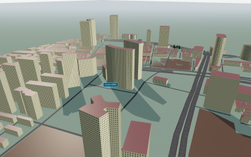
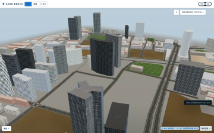
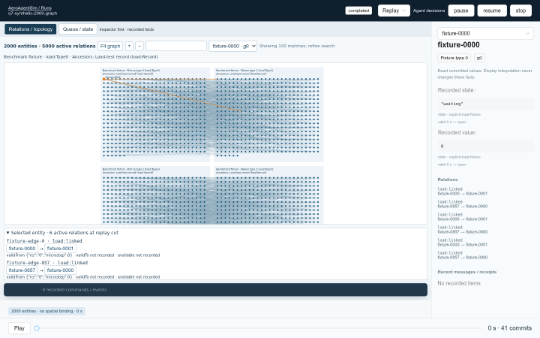

# Viewer evaluation — Q7 / D-viewer

The nonspatial presentation is implemented. The retirement decision remains **open**:
this execution environment did not expose the host's NVIDIA devices, so an RTX 3090
measurement and a hardware-versus-software comparison cannot be claimed.
SwiftShader results below are evidence for this software renderer only, not evidence
of hardware GPU throughput or superiority over AeroBench.

## Recorded facts and presentation

Runs without spatial bindings open an inspector-first relation graph. Spatial runs
keep their 3D viewport and can open either Relations / topology or Queue / state
beside it. All views use the same retained store, entity generation, replay cursor,
and selected entity. No engine or journal state is written by these views.

The graph groups entities by the recorded `TypeInfo.directory` and declared type
ancestry. The service now reads browsing names/directories from
`registry.snapshot.json/details/raw_types`, including AeroGraph's `navigation.view`;
it never reads a mutable current ontology to label a historical run. Scenario-only
types keep their exact IDs and ancestry and have no invented directory.
Ancestry is the actual is-a list, not the browsing taxonomy.

Edges come from `TemporalFeedStore.edges`, after physical valid-time and retained
knowledge-cut resolution. Assertions, finite intervals, closes, cancellations and
entity removal therefore affect the graph through the same existing feed projection
as the inspector. Edge details retain their recorded interval and availability.
The state table reads `entity.fields`, never interpolated display positions or
guessed business states. Missing, null, false and zero remain distinguishable.
Scrubbing, including a same-nanosecond commit cut, updates these exact values.

Canvas draws the graph; bounded labels and 50-row pages limit DOM size. Layout
is deterministic and avoids a force simulation. A bounded raster caches unchanged
nodes/edges while selection and labels are drawn separately. Paused nonspatial runs
do not rebuild the store on every frame. No npm dependency was added.

## Hardware probe

`frontend/e2e/q7-gpu-probe.mjs` ran headless Chromium **151.0.7922.34**, sequentially,
with one browser at a time. `/dev/nvidia*` and `/dev/dri` were absent in this sandbox;
`nvidia-smi` reported it could not communicate with the NVIDIA driver. An NVIDIA
Vulkan ICD file exists, which alone does not establish device access.

| Requested backend | Actual result |
|---|---|
| ANGLE Vulkan, Vulkan enabled, Vulkan surface disabled | WebGL probe exceeded 15 s; GPU context/Skia initialization errors |
| ANGLE GL/EGL (`--use-gl=angle --use-angle=gl-egl`) | SwiftShader |
| EGL (`--use-gl=egl`) | SwiftShader |
| Explicit ANGLE SwiftShader | SwiftShader |

Actual renderer string for all successful probes:

```text
ANGLE (Google, Vulkan 1.3.0 (SwiftShader Device (Subzero) (0x0000C0DE)), SwiftShader driver)
```

Raw evidence: [gpu-probes.json](/tmp/aas-q/q7/gpu-probes.json),
[gpu-probes.log](/tmp/aas-q/q7/gpu-probes.log). No requested hardware flag was treated
as proof of hardware rendering. The measurement harness rejects software renderer
strings when `Q7_GL=hardware` is selected.

## Measurement protocol and inputs

Use `frontend/e2e/q7-measure.mjs` against production builds. One browser/page,
1440 × 900 CSS pixels, DPR 1, two-second warmup, six-second sampling window per
case. Frame times are consecutive `requestAnimationFrame` timestamp differences;
p50/p95/p99 use nearest-rank percentiles. They include browser scheduling, compositor
wait and work on the page. CPU submission times are separately exposed; these are
not GPU timer-query measurements. Draw calls/triangles include the viewer's active
render passes, and do not count unique meshes or unique triangles.

Memory means CDP `JSHeapUsedSize`, plus Three.js geometry/texture object counts.
These counters are not GPU allocation bytes or total process RSS. GPU VRAM bytes
were not available, and no estimate is substituted.

| Input | Provenance / scope |
|---|---|
| p1-slice city | Copied recorded run `p1-slice-city-fab3c5fdfec2`; 1,645 projected journal records; 5 spatial entities plus nonspatial orders/observations |
| p1-scale city, 100 entities | Actual execution of `scenarios/visual/p1-scale-city.yaml` with only the first 100 authored entities retained; ID `q7-p1-scale-city-100`; same engine configuration; 10 simulated seconds; 45 projected records |
| Synthetic spatial, 1,000 entities | Explicit `q7-fixtures.mjs` load fixture; declared marker binding; 41 commits over 10 seconds; position/state/value updates |
| Synthetic topology, 2,000 entities / 5,000 edges | Explicit load fixture; four derived types; 41 commits; state/value updates; 100 edges close at 5 seconds |

The real runs are exported using the production journal projector and its subject
projection context. Playwright routes the exported feed through the ordinary `/runs`
HTTP viewer boundary; this avoids including backend storage pagination latency in
rendering measurements. The synthetic fixtures are explicitly named and kept in the
test harness; they are never provided as production run data.

The initial physical cursor is 0 ns, after the available 0 ns commits. Quality is
manually fixed to Balanced (`med`) for our spatial cases, preventing automatic
quality downgrades from changing the measurement mid-window. The graph interaction
window dispatches a wheel zoom event on every animation frame. Raw samples, diagnostics and screenshots
remain under `/tmp/aas-q/q7`.

## Results

All measured WebGL cases below use **verified SwiftShader**, with the renderer string
shown above. Hardware p50/p95/p99, draw calls, triangles and memory are **unmeasured**
for all three requested inputs. Canvas/table cases do not create a WebGL context.

| Case | Intervals sampled | Frame ms p50 / p95 / p99 | Draw calls p50 (max) | Triangles p50 (max) | JS heap MiB | Geometries / textures |
|---|---:|---|---|---|---:|---|
| p1-slice city, 5 spatial entities | 9 | 650.0 / 949.9 / 949.9 | 95 (95) | 219,809 (219,809) | 14.30 | 25 / 72 |
| p1-scale city, 100 spatial entities | 10 | 650.0 / 850.1 / 850.1 | 95 (95) | 242,609 (242,609) | 15.33 | 25 / 72 |
| Synthetic, 1,000 spatial entities | 13 | 483.3 / 533.3 / 533.3 | 48 (48) | 242,364 (242,364) | 50.50 | 8 / 43 |
| Matched surface: our city / 100 | 7 | 950.0 / 966.7 / 966.7 | 95 (95) | 242,609 (242,609) | 16.34 | 25 / 72 |
| Matched surface: AeroBench city / 94 | **1** | 10,899.6 / 10,899.6 / 10,899.6 | 749 (749) | 7,627,014 (7,627,014) | 62.57 | 464 / 192 |

The short software-rendering windows yield too few spatial samples for stable tail
estimates. In particular, AeroBench's one interval exceeds the nominal six-second
window: its three computed percentiles are the same single observation, **not a
usable p95/p99 distribution**. These are exploratory samples on this sandbox, not
a general performance ranking. No captured page errors occurred in the completed
cases. Full raw records:
[spatial measurements](/tmp/aas-q/q7/measurements-swiftshader-initial.json),
[AeroBench measurement](/tmp/aas-q/q7/measurements-swiftshader-bench.json).
The initial spatial result file also retains the slower pre-optimization graph
measurement; it is not the final graph result.

Final graph/state numbers appear in the separate
[nonspatial measurements](/tmp/aas-q/q7/measurements-swiftshader-topology-2000-5000.json).

| Nonspatial case | Intervals | Frame ms p50 / p95 / p99 | JS heap MiB | WebGL calls / triangles |
|---|---:|---|---:|---|
| Graph: 2,000 entities / 5,000 edges; wheel event every frame | 360 | **16.7 / 16.7 / 16.8** | 89.81 | Not applicable: Canvas 2D |
| State: 2,000 entities; paused, 50 rows per page | 361 | **16.7 / 16.7 / 16.8** | 98.03 | Not applicable: HTML table |

Graph redraw CPU p50 / p95 / p99 is **3.7 / 5.1 / 5.8 ms**; the state table has
no renderer submission counter. This graph sample measures navigation on a paused
cut. It does not establish the same throughput while continually ingesting new
large graphs. Before bitmap caching and removing redundant paused seeks, a less
frequent wheel-event run measured **166.6 / 250.0 / 400.0 ms**. The final test uses
a heavier interaction schedule, so the two runs are not an identical-workload ratio.

Browser checks verify graph selection in the inspector and mission timeline,
5,000 → 4,900 → 5,000 active relations on End/Home, and the selected state row
changing from `"running" / 1` to `"done" / 41` and back. These checks use all 41
commits, not a static mock screenshot.

CPU update/submission p50 / p95 / p99 in ms: slice **5.4 / 8.1 / 8.1**, scale100
**96.6 / 132.9 / 132.9**, synthetic1000 **13.6 / 16.7 / 16.7**, matched ours
**96.6 / 107.3 / 107.3**, AeroBench **23.5 / 23.5 / 23.5** (one sample).
These timings cover different viewer update paths and are not GPU execution times.

## Matched city comparison

AeroBench was copied from the actively edited, read-only main tree to
`/tmp/aas-q/q7/aerobench-copy`, excluding `node_modules` and `dist`. npm dependencies
were installed **offline** from a scratch copy of cached lockfile tarballs; no new
package or shared node_modules was modified. Its original build typechecked but
failed on the dangling `public/platform-0.1/native-parcel-0.1.mp4` symlink. Only this
unrelated missing video link was removed in the scratch copy; the offline build then
passed. The source main tree was not edited or built.

Both viewers use Shanghai Huangpu east. Their OSM2World mesh-pack manifests have the
same SHA-256:
`8f70bc96be129d5458336464026070fdab2af22ef12fa7435ead255e0300bc98`.
Both declare the same map origin, latitude 31.2288 / longitude 121.481.
Our synchronized public city/HDRI/model assets are copied from the platform tree into
scratch build output only; the worktree does not include those large asset bytes.

The matched camera uses position `[280,220,300]`, target `[30,25,-25]`, vertical
FOV 48°, near/far 0.15 / 16000 m, and a 1440 × 900 render surface. The scratch-only
AeroBench hook freezes its existing bundled traffic preview at **80.75 s**, removes
camera follow, and calls the existing preview renderer every frame. At this cut its
rendered counts are **53 motor vehicles + 12 bicycles + 27 pedestrians + 2 UAVs = 94**.
Ground traffic is retained SUMO-TraCI output; the two UAVs have the explicitly
declared `planned-visual-flight` source and are **not measured native flight**.
This is a viewer comparison, not a new AeroBench simulation execution. The hook
source is retained at
[aerobench-native-hook.txt](/tmp/aas-q/q7/aerobench-native-hook.txt).

An earlier attempt to adapt exactly 100 p1-scale positions into AeroBench's models
did not complete within the bounded browser run. It produced no valid comparison
metrics; [failure evidence](/tmp/aas-q/q7/aerobench-injection-failure.json) is retained.
The final comparison uses the closest working native preview with similar count,
as allowed by Q7. Positions, entity types and trajectories are consequently different.

This matches area, camera and render surface, with similar dynamic entity counts.
AeroBench retains its richer ground/road/fixture/building presentation and its own
textured X500 model. Our renderer uses instancing, distance/model-budget LOD,
HDRI and Balanced postprocessing. AeroBench disables shadows on software renderers;
our Balanced preset retains its own shadow pipeline. These differences must remain
visible when interpreting triangle/call/frame-time numbers. No equal-physics or
equal-visual-fidelity claim follows from this comparison.

Small review thumbnails (full screenshots remain in scratch):

| Our viewer, 100 entities | AeroBench, 94 entities |
|---|---|
|  |  |

Full captures: [our city](/tmp/aas-q/q7/matched-aas-100-swiftshader.png),
[AeroBench city](/tmp/aas-q/q7/matched-aerobench-native-swiftshader.png),
[graph](/tmp/aas-q/q7/topology-2000-5000-swiftshader.png),
[state table](/tmp/aas-q/q7/state-2000-swiftshader.png).



## Feature comparison

| Capability | This viewer | AeroBench's copied viewer |
|---|---|---|
| Arbitrary registry types without a pose | Inspector-first directory/ancestry graph and per-type exact state table | Primarily typed spatial entities and city/operations panels; no equivalent generic AeroGraph feed graph identified |
| Exact validity and knowledge cuts | Canonical ns/microstep and commit cuts; retained temporal facts/relations | Public trace/scene-state ticks and recorded operations/business records; a different contract |
| Spatial display | Declared bindings, interpolated display poses, instanced models/markers, LOD, trails | City entities, traffic, native presentation bindings, observation/sensor views |
| Camera choices | Orbit, follow, chase, event director | Free/chase/cockpit, mounted observation cameras, overview and navigation controls |
| City detail | Shared OSM2World pack, optional roads/trees, HDRI and quality presets | Richer road surfaces/fixtures, buildings, vegetation, water, weather/time-of-day and reflections |
| Authoring | Platform Studio region/engine/scenario workflow | City Studio, building/model placement, terrain/road and asset editing workflows |
| Business/network UI | Generic facts, relation intervals, typed subjects, command/event/receipt inspector | Dedicated operations, cargo/order/custody, telemetry, network and algorithm panels |
| Performance display | Renderer diagnostics and reproducible Q7 harness | Existing `?perf=1` / F9 overlay plus preview/observation diagnostics |

Source evidence for the copied viewer: `src/map.ts`, `src/city-studio.ts`,
`src/entity-visuals.ts`, `src/city-perf-overlay.ts`, `src/operations-monitor.ts`,
`src/state/camera.ts`, `src/app.ts`. The comparison describes source and exercised
preview rendering; it does not assert that every authoring/live-control feature was
tested end to end in Q7.

## Reproduction and gates

Scratch artifacts are intentionally untracked. The orchestrator owns committing this
worktree; no commit, branch, checkout or reset was performed.

```bash
# Run from the worktree root.
node frontend/e2e/q7-gpu-probe.mjs /tmp/aas-q/q7
# Run each frontend in its own cwd; the comparison frontend is the scratch copy.
cd frontend
npm run typecheck
npm test -- --cache=false
npm run build -- --outDir /tmp/aas-q/q7/viewer-dist
npm run preview -- --host 127.0.0.1 --port 18770 --outDir /tmp/aas-q/q7/viewer-dist
# A separate shell, inside the copied frontend:
cd /tmp/aas-q/q7/aerobench-copy
npm ci --offline --cache /tmp/aas-q/q7/npm-cache --no-audit --no-fund
npm run build
npm run preview -- --host 127.0.0.1 --port 18771
# Worktree root, after the feed exports and scratch assets are prepared:
Q7_CASES=p1-slice-city,p1-scale-city-100,synthetic-1000 node frontend/e2e/q7-measure.mjs
Q7_CASES=topology-2000-5000 node frontend/e2e/q7-measure.mjs
Q7_CASES=bench node frontend/e2e/q7-measure.mjs
# Same harness once real GPU device access is available:
Q7_GL=hardware node frontend/e2e/q7-measure.mjs
```

Feed preparation uses scratch runs only. The retained 100-entity scenario is
[p1-scale-city-100.yaml](/tmp/aas-q/q7/p1-scale-city-100.yaml); its only authored
changes are ID and truncating the original `entities` list to its first 100 entries.
The execution command was:

```bash
PYTHONDONTWRITEBYTECODE=1 PYTHONPATH=src MYPYPATH=../aerokernel \
 AEROAGENTSIM_AEROGRAPH_ROOT=/mnt/data2/weizhiwei/AeroGraph \
 /mnt/data2/weizhiwei/aeroagentsim/AeroAgentSim-platform/.venv/bin/python \
 -m aeroagentsim.services.cli run /tmp/aas-q/q7/p1-scale-city-100.yaml \
 --out /tmp/aas-q/q7/runs
```

The printed run directory changes on a new execution. For the retained directories,
export with the mandated interpreter/environment:

```python
import json
from pathlib import Path
from aeroagentsim.services.storage import RunStorage
from aeroagentsim.services.projector import header, project
from aeroagentsim.services.subjects import projection_context

root = Path('/tmp/aas-q/q7')
for name, run in [
    ('slice-feed', 'p1-slice-city-fab3c5fdfec2'),
    ('scale100-feed', 'p1-scale-city-100-42796dc2258a'),
]:
    directory = root / 'runs' / run
    subjects = projection_context(directory, 1)
    commits = [project(record, subjects=subjects)
               for record in RunStorage(directory).records(1, 100000)]
    (root / f'{name}.json').write_text(json.dumps({
        'header': header(directory), 'commits': commits,
    }))
```

Our build output additionally needs the existing city, HDRI and X500 assets under
its normal `/assets/` paths; the retained scratch output already contains them.
Copy these assets to scratch output from the read-only platform public directory,
without modifying the shared source. AeroBench reproduction needs the retained
scratch hook above inserted into its camera/controls initialization; its source
remains copied under scratch. The committed harness never patches the live main tree.

Python checks use the mandated interpreter from the worktree root:

```bash
PYTHONDONTWRITEBYTECODE=1 PYTHONPATH=src MYPYPATH=../aerokernel \
 /mnt/data2/weizhiwei/aeroagentsim/AeroAgentSim-platform/.venv/bin/python -m ruff check \
 src/aeroagentsim/services/projector.py tests/platform/test_projector_presentation.py
PYTHONDONTWRITEBYTECODE=1 PYTHONPATH=src MYPYPATH=../aerokernel \
 /mnt/data2/weizhiwei/aeroagentsim/AeroAgentSim-platform/.venv/bin/python -m mypy --strict \
 --cache-dir /tmp/aas-q/q7/mypy-cache \
 src/aeroagentsim/services/projector.py tests/platform/test_projector_presentation.py
PYTHONDONTWRITEBYTECODE=1 PYTHONPATH=src MYPYPATH=../aerokernel \
 AEROAGENTSIM_AEROGRAPH_ROOT=/mnt/data2/weizhiwei/AeroGraph \
 /mnt/data2/weizhiwei/aeroagentsim/AeroAgentSim-platform/.venv/bin/python -m pytest \
 -q -p no:cacheprovider -m "not docker" tests/platform \
 --basetemp /tmp/aas-q/q7/pytest
# Separate new-test run after collection of the full suite:
PYTHONDONTWRITEBYTECODE=1 PYTHONPATH=src MYPYPATH=../aerokernel \
 AEROAGENTSIM_AEROGRAPH_ROOT=/mnt/data2/weizhiwei/AeroGraph \
 /mnt/data2/weizhiwei/aeroagentsim/AeroAgentSim-platform/.venv/bin/python -m pytest \
 -q -p no:cacheprovider -m "not docker" tests/platform/test_projector_presentation.py \
 --basetemp /tmp/aas-q/q7/pytest-presentation
```

ruff and strict mypy: **passed, 2 files**. Platform suite: **145 passed** in
188.72 s, plus the newly added pinned-presentation test **1 passed** in 7.87 s
(collected after the full run began). The full run has one existing
Starlette/httpx deprecation warning. No adapters/agents/packs/authoring implementation
changed; their suites and Docker/native simulators were not run for Q7.

Frontend: `npm run typecheck` **passed**; `npm test -- --cache=false` **20 files /
91 tests passed**; production build **passed**. The default test command passed its
tests but failed writing the Vitest results cache through read-only shared
`node_modules`; disabling that cache resolved the command. No npm package was added.
`node --check` passed for all three Q7 `.mjs` harness files; `git diff --check` passed.

Two concurrent broad WorkBuddy DSH tasks (components and read-only comparison audit)
were stopped after prolonged reasoning and incomplete output; their partial code was
not accepted. Two narrower tasks then **completed with exit 0**: eight
temporal fixture cases and a four-item source audit. The cases were checked against
the real temporal store and integrated; audit wording conflating AeroAgentSim and
AeroBench was corrected against source. All sessions selected
`workbuddy/glm-5.3-flash`, **131072 maxTokens**, no effort parameter. Reviewed outputs
and actual session logs remain under `/tmp/aas-q/q7/glm-cases`, `glm-audit`,
`glm-graph`, `glm-bench` and `dsh-home/sessions`. Implementation, measurement and
gate verification remained the parent agent's responsibility.

The nonspatial presentation gate has usable implementation and measured evidence.
D-viewer's hardware comparison and broader visual/authoring replacement gate remain
open; this report does not authorize retiring AeroBench.
