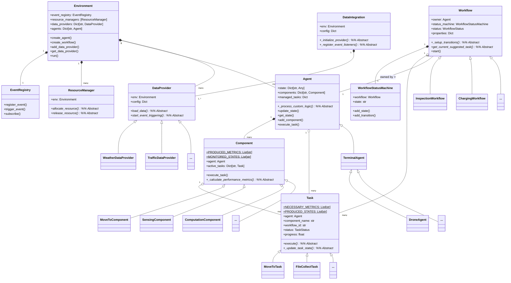

```mermaid
classDiagram
    %% 核心类
    class Environment {
        +event_registry: EventRegistry
        +resource_managers: [ResourceManager]
        +data_providers: Dict[str, DataProvider]
        +agents: Dict[str, Agent]
        +create_agent()
        +create_workflow()
        +add_data_provider()
        +get_data_provider()
        +run()
    }

    class Agent {
        +state: Dict[str, Any]
        +components: Dict[str, Component]
        +managed_tasks: Dict
        +_process_custom_logic()* %% Abstract
        +update_state()
        +get_state()
        +add_component()
        +execute_task()
    }

    class Component {
        +PRODUCED_METRICS: List[str]$
        +MONITORED_STATES: List[str]$
        +agent: Agent
        +active_tasks: Dict[str, Task]
        +execute_task()
        +_calculate_performance_metrics()* %% Abstract
    }

    class Task {
        +NECESSARY_METRICS: List[str]$
        +PRODUCED_STATES: List[str]$
        +agent: Agent
        +component_name: str
        +workflow_id: str
        +status: TaskStatus
        +progress: float
        +execute()* %% Abstract
        +_update_task_state()* %% Abstract
    }

    class Workflow {
        +owner: Agent
        +status_machine: WorkflowStatusMachine
        +status: WorkflowStatus
        +properties: Dict
        +_setup_transitions()* %% Abstract
        +get_current_suggested_task()* %% Abstract
        +start()
    }

    class WorkflowStatusMachine {
        +workflow: Workflow
        +state: str
        +add_state()
        +add_transition()
    }

    class EventRegistry {
        +register_event()
        +trigger_event()
        +subscribe()
    }

    class ResourceManager {
        +env: Environment
        +allocate_resource()* %% Abstract
        +release_resource()* %% Abstract
    }
    
    class DataProvider {
        +env: Environment
        +config: Dict
        +load_data()* %% Abstract
        +start_event_triggering()* %% Abstract
    }
    
    class DataIntegration {
        +env: Environment
        +config: Dict
        +_initialize_provider()* %% Abstract
        +_register_event_listeners()* %% Abstract
    }

    %% Agent子类
    class TerminalAgent
    class DroneAgent
    class AgentEllipsis["..."]

    %% Component子类
    class MoveToComponent
    class SensingComponent
    class ComputationComponent
    class ComponentEllipsis["..."]

    %% Workflow子类
    class InspectionWorkflow
    class ChargingWorkflow
    class WorkflowEllipsis["..."]

    %% Task子类
    class MoveToTask
    class FileCollectTask
    class TaskEllipsis["..."]
    
    %% DataProvider子类
    class WeatherDataProvider
    class TrafficDataProvider
    class DataProviderEllipsis["..."]

    %% 核心关系
    Environment "1" *-- "1" EventRegistry
    Environment "1" *-- "many" ResourceManager
    Environment "1" *-- "many" Agent
    Environment "1" *-- "many" DataProvider

    Agent "1" *-- "many" Component
    Agent "1" o-- "many" Task
    Component "1" o-- "many" Task

    Workflow "1" *-- "1" WorkflowStatusMachine
    Workflow "1" o-- "many" Task
    Workflow "many" -- "1" Agent : owned by >
    
    DataIntegration "1" *-- "1..*" DataProvider

    %% 继承关系
    Agent <|-- TerminalAgent
    TerminalAgent <|-- DroneAgent
    TerminalAgent <|-- AgentEllipsis

    Component <|-- MoveToComponent
    Component <|-- SensingComponent
    Component <|-- ComputationComponent
    Component <|-- ComponentEllipsis

    Workflow <|-- InspectionWorkflow
    Workflow <|-- ChargingWorkflow
    Workflow <|-- WorkflowEllipsis

    Task <|-- MoveToTask
    Task <|-- FileCollectTask
    Task <|-- TaskEllipsis
    
    DataProvider <|-- WeatherDataProvider
    DataProvider <|-- TrafficDataProvider
    DataProvider <|-- DataProviderEllipsis
```
