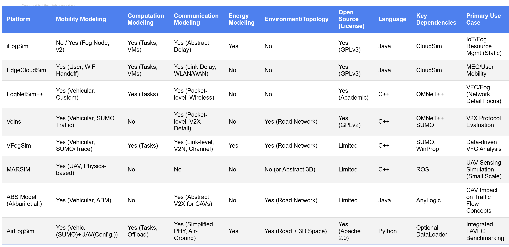
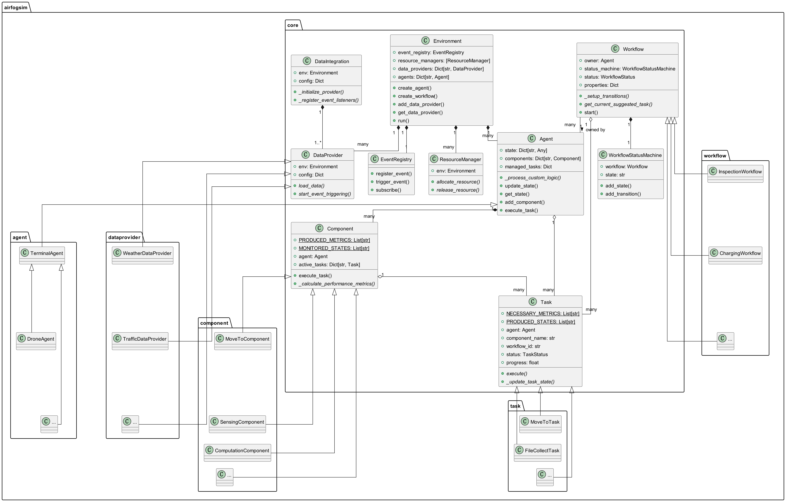

# Summary

AirFogSim is an Agent-Based Modeling (ABM) simulation package designed specifically for benchmarking collaborative intelligence in Low-Altitude Vehicular Fog Computing (LAVFC) systems. It provides a lightweight yet comprehensive Python-based simulation framework for modeling the complex dynamics, resource constraints, and collaborative intelligence strategies within these LAVFC systems, facilitating research and development in this emerging field. The AirFogSim repository was initially created in December 2023, with the current specialized branch for LAVFC systems being actively developed since March 2024. The package consists of 129 Python modules with over 25,000 lines of code, and is publicly maintained at [GitHub](https://github.com/ZhiweiWei-NAMI/AirFogSim).

# Statement of need

The proliferation of Unmanned Aerial Vehicles (UAVs) is transforming low-altitude airspace, enabling the *Low-Altitude Economy* [@low_altitude_market_A] with diverse applications in logistics, surveillance, and advanced air mobility. Managing this complex and dynamic environment effectively demands intelligent, scalable, and real-time solutions [@10673979]. *Low-Altitude Vehicular Fog Computing* (LAVFC) emerges as a promising paradigm, integrating UAVs with vehicular networks and fog computing infrastructures to facilitate efficient, collaborative operations [@highway_uav]. **However, evaluating the performance and feasibility of diverse LAVFC strategies is challenging due to the complex interplay of mobility, communication, computation, and resource constraints, thus necessitating robust and flexible simulation tools.**

Existing platforms like iFogSim [@ifogsim;@ifogsim2] and EdgeCloudSim [@edgecloudsim] excel in modeling computation and basic energy aspects but typically lack realistic mobility and detailed communication channel models crucial for dynamic air-ground scenarios. Conversely, network-centric simulators such as Veins [@veins] and FogNetSim++ [@fognetsimpp] provide high-fidelity communication and traffic modeling, often leveraging OMNeT++ [@omenetpp] and SUMO [@sumo_2012], yet generally require substantial extensions to incorporate sophisticated computation task management or energy constraints. Other specialized tools may focus primarily on vehicular fog contexts like VFogSim [@10168727], whose advanced channel modeling may depend on proprietary software like WinProp, or concentrate on UAV operations as seen in Anylogic's simulator [@abs_logic], implemented using the commercial AnyLogic platform, or MARSIM [@10091117] using ROS, whose availability may be restricted.

{#fig:other_sim}

AirFogSim distinguishes itself by offering an integrated, open-source framework specifically designed to bridge these gaps for the burgeoning LAVFC domain [@10673979]. Developed in Python for enhanced flexibility and accessibility, it employs a unified workflow-agent-task architecture tailored for diverse LAVFC applications. Furthermore, to bolster realism beyond pure simulation, AirFogSim uniquely provides standardized DataLoader and DataIntegration interfaces, facilitating the seamless incorporation of real-world datasets, such as traffic data from SUMO [@sumo_2012] or meteorological data via OpenWeatherMap API.

# AirFogSim Fundamentals

Key concepts in AirFogSim include:

*   **`Environment`**: Orchestrates simulation time, manages agent/resource registries, and facilitates event communication via the `EventRegistry`. It extends SimPy's `Environment` and serves as the central hub for all simulation entities and managers.
*   **`Agent`**: Represents active entities (UAVs, base stations, edge nodes). Each has an ID, internal `state` (position, battery), attached `components`, and can interact with workflows through the environment's workflow manager.
*   **`Component`**: Encapsulates agent capabilities (e.g., `MoveToComponent`, `CPUComponent`). Components monitor agent state, generate performance metrics, and execute relevant tasks.
*   **`Task`**: An atomic unit of work (e.g., `MoveToTask`, `ImageProcessingTask`) executed by a component. Tasks consume metrics, calculate progress,  potentially modify agent state (`PRODUCED_STATES`), and adhere to priorities.
*   **`Workflow`**: Defines higher-level processes or mission plans (e.g., `InspectionWorkflow`, `ChargingWorkflow`) involving multiple tasks. Uses a `WorkflowStatusMachine` to manage states and transitions triggered by time, events, or agent state changes.
*   **`DataProvider`**: Integrates external data sources (e.g., weather, traffic) into the simulation environment, enabling more realistic scenarios.
*   **`EventRegistry`**: Central publish-subscribe system for decoupled communication between simulation entities.
*   **`Resource` / `ResourceManager`**: Models limited shared assets (e.g., charging spots, spectrum) managed by specific managers.


{#fig:architecture}

Figure \ref{fig:architecture} shows the core architecture of AirFogSim: `Environment` manages the simulation and contains various managers; `Agent` represents entities with state and components; `Component` provides capabilities and executes tasks; `Task` represents atomic units of work; and `Workflow` defines higher-level processes using state machines.

# Developing AirFogSim: Exploring Custom Extensions

AirFogSim's object-oriented design facilitates extension through inheritance.

1.  **Custom Agent:** Inherit from `core.agent.Agent` (or subclasses like `DroneAgent`). Define custom `_state_templates` in `AgentMeta` subclasses for unique states.
2.  **Custom Component:** Inherit from `core.component.Component`. **Determine** capabilities based on `agent.state` via `MONITORED_STATES`. Implement `_calculate_performance_metrics` to generate `PRODUCED_METRICS`.
3.  **Custom Task:** Inherit from `core.task.Task`. Define class attributes `NECESSARY_METRICS` and `PRODUCED_STATES`. Implement the core logic within the `execute()` SimPy generator function, yielding delays, handling metric changes, and updating agent state.
4.  **Custom Workflow:** Inherit from `core.workflow.Workflow`. Implement `_setup_transitions` using `status_machine.add_state()` and `status_machine.add_transition()` with appropriate triggers (`StateTrigger`, `TimeTrigger`, `EventTrigger`).
5.  **Custom DataProvider:** Inherit from `core.dataprovider.DataProvider`. Implement `load_data()` to retrieve data from external sources and `start_event_triggering()` to create SimPy processes that trigger events based on the loaded data at appropriate simulation times.

# Using AirFogSim: A Collaborative Logistics Example

The following example demonstrates AirFogSim's capabilities in modeling collaborative logistics operations, a key application domain for LAVFC systems:

1.  **Initialize Environment:** Create the simulation environment with appropriate visualization interval.

    ```{.python}
    env = Environment(visual_interval=100)
    ```

2.  **Create Delivery Stations:** Define multiple delivery stations with specific properties. The stations periodically generate payloads workflows and select drones for delivery.

    ```{.python}
    station1 = DeliveryStation(
        env, "center_station",
        properties={
            'position': [0, 0, 0],
            'storage_capacity': 200,
            'service_radius': 100.0,
            'payload_generation_model': {...}
        }
    )
    ```

3.  **Create Delivery Drones:** Instantiate multiple drone agents with varying properties and components.

    ```{.python}
    drone = DeliveryDroneAgent(
        env, "delivery_drone_1",
        properties={
            'position': [0, 0, 10],
            'battery_level': 90.0,
            'max_payload_weight': 5.0
        }
    )
    # Add components
    drone.add_component(MoveToComponent(...)).
          add_component(LogisticsComponent(...))
    env.register_agent(drone)
    ```

4.  **Run Simulation and Analyze Results:** Execute the simulation and examine outcomes.

    ```{.python}
    env.run(until=3600)
    ```

# Visualization and Analysis

AirFogSim also includes a web-based visualization system using FastAPI and React for real-time monitoring. It provides:

{#fig:3d}

{#fig:monitor}


1.  **3D Map View**: Shows agent positions, trajectories, resource locations.
2.  **Dashboard**: Displays key performance indicators and system events.


# Acknowledgements

This work is supported by the National Natural Science Foundation of China under Grant 62271351 and 62201390.

# References