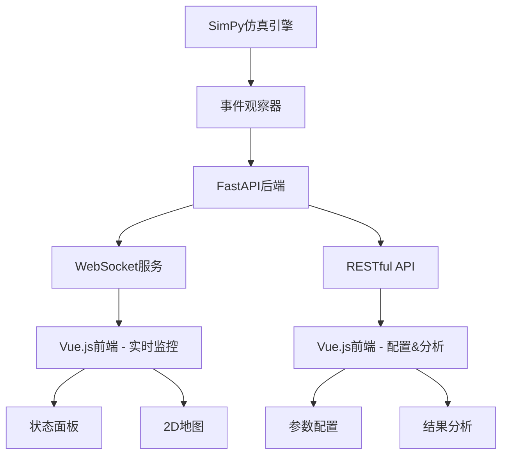
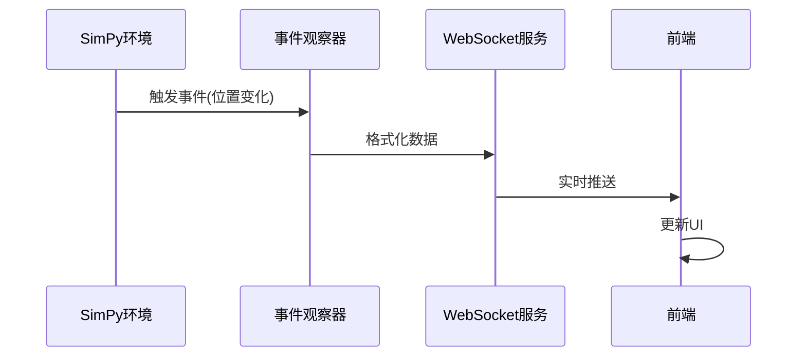
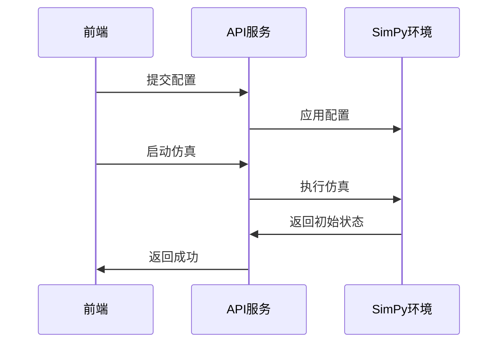

# AirFogSim 前端界面开发计划

## 1. 需求概述

AirFogSim是一个基于Python SimPy的无人机仿真系统，需要开发一个前端界面来实现以下功能：

- 2D地图视图展示无人机轨迹（预留3D扩展接口）
- 模拟参数配置界面
- 资源使用统计图表
- 代理状态监控面板
- 实时监控模拟过程
- 分析模拟结果

## 2. 技术栈推荐

基于项目需求和SimPy集成需求，我推荐以下技术栈：

### 后端
- **FastAPI**：高性能异步框架，非常适合与SimPy的异步特性配合
  - 优势：性能卓越，支持异步/WebSocket，API文档自动生成
  - 与SimPy集成：SimPy的事件循环可以与FastAPI的异步架构无缝对接

### 前端
- **Vue.js**：轻量级框架，学习曲线平缓
  - UI库：Element Plus（中文支持良好）
  - 图表库：ECharts（功能全面，适合资源统计和状态监控）
  - 地图可视化：Leaflet.js（轻量级，支持自定义图层）

### 实时通信
- **WebSockets**：通过FastAPI和Vue集成，实现仿真数据实时传输

### 数据处理
- **Pandas**：用于后端数据处理和分析
- **NumPy**：数值计算支持

## 3. 系统架构



## 4. 主要模块详细设计

### 后端模块

1. **仿真接口层**
   - 与SimPy环境集成，捕获仿真事件
   - 实现事件观察器模式，监听代理状态变化、任务执行等事件
   - 转换仿真数据为易于前端使用的格式

2. **API服务**
   - 提供RESTful API：
     - 仿真配置（创建无人机、设置资源、定义工作流）
     - 获取历史数据
     - 启动/暂停/停止仿真
   - WebSocket服务：
     - 实时推送代理位置更新
     - 推送资源使用状况
     - 推送状态变化事件

3. **数据处理**
   - 仿真结果存储与检索
   - 基础数据分析功能

### 前端模块

1. **配置界面**
   - 无人机创建与配置
   - 空域、频率、着陆点等资源设置
   - 工作流定义与参数调整
   - 批量仿真配置

2. **2D地图视图**
   - 显示无人机实时位置和轨迹
   - 显示资源位置（如充电站、着陆点）
   - 空域可视化（如限制区域）
   - 缩放、平移功能
   - 预留3D视图升级接口

3. **状态监控面板**
   - 无人机状态实时展示（电量、位置、任务）
   - 资源使用情况（空域占用、频率使用）
   - 系统事件日志

4. **数据分析**
   - 资源使用统计图表
   - 任务完成情况分析
   - 电量消耗分析
   - 可导出数据报告

## 5. 数据流设计

### 实时数据流
- SimPy事件 → 事件观察器 → WebSocket → 前端实时更新



### 配置数据流
- 前端配置 → API请求 → 仿真环境配置 → 启动仿真



## 6. API设计概要

### RESTful API

```
GET  /api/simulation/status        # 获取仿真状态
POST /api/simulation/start         # 启动仿真
POST /api/simulation/pause         # 暂停仿真
POST /api/simulation/stop          # 停止仿真
POST /api/
     # 配置仿真参数

GET  /api/agents                   # 获取所有代理
POST /api/agents                   # 创建代理
GET  /api/agents/{id}              # 获取特定代理
PUT  /api/agents/{id}              # 更新代理

GET  /api/resources                # 获取所有资源
POST /api/resources/{type}         # 创建资源
GET  /api/resources/{type}/{id}    # 获取特定资源

GET  /api/workflows                # 获取所有工作流
POST /api/workflows                # 创建工作流

GET  /api/results                  # 获取仿真结果
GET  /api/results/export           # 导出结果数据
```

### WebSocket事件

```
agent_update        # 代理状态更新
resource_update     # 资源状态更新
task_update         # 任务状态更新
workflow_update     # 工作流状态更新
simulation_stats    # 仿真统计数据
```

## 7. 界面原型设计

### 主界面布局

```
+------------------------------------------+
|              顶部导航栏                   |
+------------------------------------------+
|              |                           |
|  控制面板     |         2D地图视图         |
|  --------    |                           |
|  参数设置     |                           |
|  代理列表     |                           |
|  资源状态     |                           |
|              |                           |
+------------------------------------------+
|              数据分析面板                  |
+------------------------------------------+
```

### 控制面板原型

```
+---------------------------+
|      仿真控制              |
|  [开始] [暂停] [停止]      |
+---------------------------+
|      模拟速度              |
|  [----------O--------]   |
+---------------------------+
|      无人机列表            |
|  * 无人机1 [电量: 90%]    |
|  * 无人机2 [电量: 85%]    |
+---------------------------+
|      资源使用              |
|  空域A: 3/10             |
|  频率B: 2/5              |
+---------------------------+
```

### 2D地图视图原型

```
+----------------------------------+
|   [+] [-]       [2D] [预留3D]    |
|                                  |
|       *着陆点A                    |
|                                  |
|    *无人机1                       |
|             -------              |
|            |限制区域|              |
|    *无人机2  -------              |
|                                  |
|                  *着陆点B         |
|                                  |
+----------------------------------+
```

## 8. 实现路线图

### 阶段一：基础框架 (2-3周)
1. 设置FastAPI后端结构
2. 实现SimPy与FastAPI的集成
3. 创建Vue前端框架
4. 实现基本WebSocket连接
5. 开发简单2D地图显示

### 阶段二：核心功能 (3-4周)
1. 实现完整的API端点
2. 开发仿真参数配置界面
3. 完善2D地图视图功能
4. 实现代理状态监控面板
5. 开发基本资源统计图表

### 阶段三：高级功能与优化 (2-3周)
1. 添加高级数据分析功能
2. 优化实时性能
3. 完善用户体验
4. 实现数据导出功能
5. 编写文档和使用示例

## 9. 扩展性考虑

1. **3D扩展**：
   - 预留Three.js集成接口
   - 设计数据结构支持3D坐标

2. **模块化设计**：
   - 组件化前端开发，便于功能扩展
   - 后端使用插件架构，支持新资源类型和分析功能

3. **性能优化**：
   - 大规模仿真考虑数据流优化
   - 前端渲染性能优化策略

## 10. 总结

本计划提出了一个基于FastAPI + Vue.js的AirFogSim前端界面解决方案，专注于实现2D可视化、参数配置、资源监控等核心功能，同时预留3D扩展能力。该方案充分利用了Python生态系统的优势，保持与现有SimPy代码的无缝集成，同时提供现代化的Web界面体验。

实现这一方案将使AirFogSim项目获得直观的可视化界面，极大提高用户体验和仿真分析能力。系统设计保持了灵活性和可扩展性，以适应未来的需求变化。